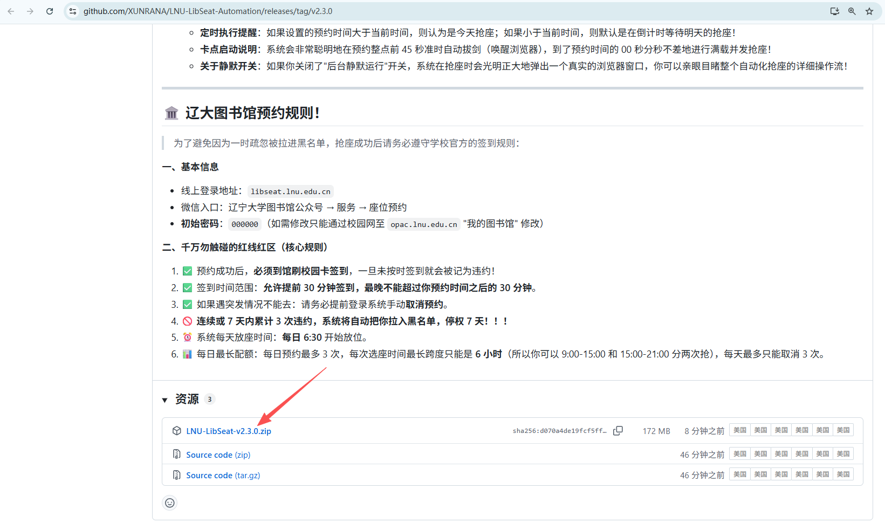
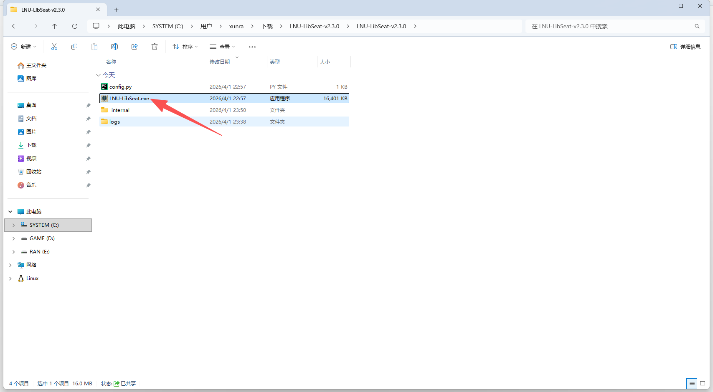

<div align="center">

<table border="0" cellpadding="0" cellspacing="0">
<tr>
<!-- Logo -->
<td width="250" align="center" valign="middle">

</td>
<!-- 标题 + 标语 + 徽章 -->
<td colspan="3" valign="middle" padding-left="10">

<h1 align="left">LNU-LibSeat</h1>

<h3 align="left">🎯 辽宁大学图书馆 · 智能抢座神器</h3>

<p align="left"><strong>6:30 它替你抢座 · 整点零延迟提交 · 邮件秒达战报</strong></p>

<p align="left">
<a href="https://python.org"></a>
<a href="https://selenium.dev"></a>
<a href="https://github.com/XUNRANA/LNU-LibSeat-Automation/releases/latest"></a>
<a href="#-免责声明"></a>
<a href="https://github.com/XUNRANA/LNU-LibSeat-Automation"></a>
</p>

</td>
</tr>
<!-- 统计数据行 -->
<tr>
<td align="center" width="250" height="160"><h1>100%</h1>API 验证码准确率</td>
<td align="center" width="250" height="160"><h1>65.7%</h1>本地 OCR 一把过</td>
<td align="center" width="250" height="160"><h1>20 间</h1>双校区自习室全覆盖</td>
<td align="center" width="250" height="160"><h1>0 元</h1>你的使用成本</td>
</tr>
</table>

</div>

---

> [!IMPORTANT]
> 💸 **「图鉴 API 抢座」开关默认关闭——请保持关闭！**
> 这是付费 API（**0.016 元/次**），目前由作者**自掏腰包**。
>
> 详见下方 [§ 关于图鉴 API 抢座](#-关于图鉴-api-抢座开关) 一节。

> [!WARNING]
> 🛡️ **准时到馆签到！** 连续或 7 天内累计 **3 次违约 = 黑名单 7 天**，所有账号都不能预约。

> [!TIP]
> 第一次用？跳到 [§ 三步开始](#-三步开始30-秒上手) 30 秒搞定。想看新版变化？翻 [v3.0.0 升级日志](docs/RELEASE_NOTES.md)。

---

## 🎯 这是什么

一个**双击即用**的 Windows 桌面工具，帮你在辽大图书馆每天 **06:30 放座**的瞬间完成：

登录 → 进自习室 → 锁定座位 → 识别验证码 → 提交预约 → 邮件通知。**不用装 Python，不用懂代码。**

### 适合谁用？

<table width="1000">
<tr>
<td align="center" width="333">
<h2>🎓 普通学生</h2>
不想 6:30 起床抢座<br>
想要每天稳定占到心仪的位置
</td>
<td align="center" width="333">
<h2>📚 考研党 / 自习党</h2>
全天候图书馆挂机<br>
双账号分时段无缝衔接 9:00-21:00
</td>
<td align="center" width="333">
<h2>🌙 错峰玩家</h2>
6:30 准时抢座<br>
冷门座位成功率 100%
</td>
</tr>
</table>

---

## ⚖️ 手动 vs LNU-LibSeat

<table width="1000">
<tr><th align="left" width="250">抢座环节</th><th align="left" width="375">😩 手动操作</th><th align="left" width="375">⚡ LNU-LibSeat</th></tr>
<tr><td><b>6:30 起床</b></td><td>必须，闹钟 5 个</td><td>❌ 不用，程序定时唤醒</td></tr>
<tr><td><b>验证码识别</b></td><td>眼花点 5 次还点不准</td><td>AI <b>0.5s</b> 识别</td></tr>
<tr><td><b>抢座失败重试</b></td><td>手动刷新→重选→重做验证码</td><td>✅ 自动换座 + 自动重做</td></tr>
<tr><td><b>不填座位号</b></td><td>不可能，必须挑一个</td><td>✅ 留空 → 自动扫整间自习室</td></tr>
<tr><td><b>双账号同时抢</b></td><td>物理开两个浏览器</td><td>✅ 多线程并发</td></tr>
<tr><td><b>整点零延迟提交</b></td><td>你最快也比 06:30:00 慢 1-3 秒</td><td>✅ 程序毫秒级精度</td></tr>
<tr><td><b>抢中后通知</b></td><td>自己刷新页面看</td><td>📧 邮件秒达手机</td></tr>
<tr><td><b>出问题排查</b></td><td>完全靠回忆</td><td>📁 录屏 + 4 阶段截图 + 日志</td></tr>
</table>

---

## 🚀 三步开始（30 秒上手）

<table width="1000">
<tr>
<td align="center" width="333">
<h3>① 下载</h3>
<a href="https://github.com/XUNRANA/LNU-LibSeat-Automation/releases/latest">

</a>
<p>去 <a href="https://github.com/XUNRANA/LNU-LibSeat-Automation/releases/latest">Releases</a> 下载<br><code>LNU-LibSeat-v3.0.0.zip</code></p>
</td>
<td align="center" width="333">
<h3>② 解压 → 双击</h3>

<p>解压到任意位置<br>双击 <code>LNU-LibSeat.exe</code></p>
</td>
<td align="center" width="333">
<h3>③ 填表 → 开始</h3>

<p>填学号密码 + 时段<br>点「🚀 开始抢座」</p>
</td>
</tr>
</table>

> [!NOTE]
> ❌ **不需要** Python、命令行、环境变量、手动下驱动——所有依赖都打包进 exe 了。
>
> ✅ 唯一前提：Windows 10/11 + 装了 Edge 或 Chrome（任意较新版本即可）。

---

## 💎 核心特色

<table width="1000">
<tr>
<td width="333" valign="top">
<h3>🎯 全自习室扫描</h3>
首选座位失败后<b>自动随机扫描</b>该自习室剩下的座位，双校区 <b>20 间</b>自习室全覆盖。
</td>
<td width="333" valign="top">
<h3>🤖 双引擎验证码 OCR</h3>
<b>图鉴 API（商业级）+ ddddocr</b>，再叠 ActionChains + JS 双保险点击，确保 Vue 异步渲染下也能命中。
</td>
<td width="333" valign="top">
<h3>📁 会话级追溯</h3>
每次抢座生成独立目录：<b>session.log + 4 阶段截图 + MP4 录屏 + 抢座顺序清单</b>。
</td>
</tr>
<tr>
<td width="333" valign="top">
<h3>⏱️ 毫秒级精确卡点</h3>
提前 30s 启动浏览器 → 提前 6s 锁定座位 → 整点 06:30:01 提交。
</td>
<td width="333" valign="top">
<h3>🧵 双账号多线程</h3>
两个学号<b>同时跑</b>，分时段无缝衔接（如 9:00-15:00 + 15:00-21:00 = 全天覆盖）。
</td>
<td width="333" valign="top">
<h3>📧 邮件通知</h3>
抢座成功自动发战报到你邮箱：座位号 / 时段 / 自习室一应俱全。
</td>
</tr>
</table>

---

## 🎬 实战截图秀

### 定时模式 — 双账号分时段挂机


### 立即执行 — 自动登录 + 验证码识别 + 选座全流程


### 抢座成功 — 双账号同时锁定 + 邮件通知


### 手机即时收到成功通知邮件

<p align="center">
  
</p>

---

## 💸 关于「图鉴 API 抢座」开关

> [!IMPORTANT]
> **这个开关默认是关闭的，请保持关闭！**
> 系统已经在 **06:30-06:35 高峰期自动启用 API**（5 分钟窗口），其他时间用免费本地 OCR 已经足够。**不需要你手动开。**

### 它是什么？

付费的商业 OCR API（**[TTShiTu 图鉴](http://api.ttshitu.com)**），用于识别预约时的"按顺序点击文字"点选验证码。
- 🎯 **100% 一次过**（实测 14/14）
- ⏱️ 平均延迟 **7.2s**（高并发下波动 3.5s ~ 17.8s）

### 它有多贵？

> [!CAUTION]
> **0.016 元/次**——无论识别成功还是失败都扣费。
>
> 高峰期一个账号可能消耗 **30~50 次**调用 ≈ **0.5-0.8 元/次抢座**。

### 谁在付钱？

**作者**。GUI 内嵌作者的图鉴账号，所有调用都从作者的钱包扣费。

### 为什么默认关？

✅ 系统在 **06:30:00 - 06:35:00** 这 5 分钟**自动**启用 API（最卷的时段拼准确率）

✅ 其他时段用免费**本地 OCR**：65.7% 一把过 / 95.2% 三次内通过 / **100% 五次内通过**——已足够

### 如果作者钱包烧光了怎么办？

> [!WARNING]
> 一旦使用人数继续增长、资金紧张，**免费 API 会随时停止**。
>
> 届时大家要拿**自己的图鉴账号充钱**才能继续用 API（本地 OCR 仍然免费）。
>
> 想避免这种情况？👉 [☕ 滚到下面随手赞助 ](#-求赞助--让免费持续) ❤️

---

## 📊 验证码识别实测数据

> 数据来自真实高峰期抢座会话（06:30 放座，244 个座位遍历），分引擎统计。

<table width="1000">
  <tr>
    <td valign="top" width="333">
      <b>🌐 图鉴 API（商业级，最多 5 次）</b><br><br>
      <table>
        <tr><th>指标</th><th>数值</th></tr>
        <tr><td>识别成功率</td><td><b>100%</b> (14/14)</td></tr>
        <tr><td>最低延迟</td><td><b>3.54s</b></td></tr>
        <tr><td>最高延迟</td><td><b>17.82s</b></td></tr>
        <tr><td>平均延迟</td><td><b>7.21s</b></td></tr>
        <tr><td>中位数延迟</td><td><b>5.96s</b></td></tr>
      </table>
    </td>
    <td valign="top" width="333">
      <b>💻 本地 OCR 单次成功率（免费离线）</b><br><br>
      <table>
        <tr><th>指标</th><th>数值</th></tr>
        <tr><td>识别成功率</td><td><b>61.2%</b> (93/152)</td></tr>
        <tr><td>最低延迟</td><td><b>0.32s</b></td></tr>
        <tr><td>最高延迟</td><td><b>0.65s</b></td></tr>
        <tr><td>平均延迟</td><td><b>0.51s</b></td></tr>
        <tr><td>中位数延迟</td><td><b>0.53s</b></td></tr>
      </table>
    </td>
    <td valign="top" width="333">
      <b>📈 本地 OCR 累计通过分布（最多 10 次）</b><br><br>
      <table>
        <tr><th>尝试次数</th><th>座位数</th><th>占比</th></tr>
        <tr><td>1 次通过</td><td>69</td><td><b>65.7%</b></td></tr>
        <tr><td>2 次通过</td><td>17</td><td>16.2%</td></tr>
        <tr><td>3 次通过</td><td>14</td><td>13.3%</td></tr>
        <tr><td>4 次通过</td><td>4</td><td>3.8%</td></tr>
        <tr><td>5 次通过</td><td>1</td><td>1.0%</td></tr>
      </table>
    </td>
  </tr>
</table>

**为什么默认走免费 OCR？** 因为本地 OCR 速度快 **14 倍**（0.51s vs 7.21s），且累计通过率 **95.2% 三次内通过**。只在最卷的 6:30-6:35 才用 API 拼准确率。

---

## ☕ 求赞助 — 让免费持续

> [!NOTE]
> 作者目前**免费**支撑大家用 API。
> **随手扫码赞助**就够付一次抢座的成本。
>
> 你的赞助 **100% 转化为图鉴 API 调用费用**——直接养活这个项目本身。

<table align="center" border="0" cellspacing="0">
<tr>
<td align="center"><br><b>支付宝</b></td>
<td width="300" align="center" valign="middle">
  <b>☕ 你的赞助都将用于</b><br>
  <b>图鉴 API 调用</b><br>
  <sub>让免费持续 ❤️</sub>
</td>
<td align="center"><br><b>微信支付</b></td>
</tr>
</table>

---

## 🛟 高频 FAQ

<details>
<summary><b>Q1: 我一点 Python 都不懂，能用吗？</b></summary>

✅ 完全没问题。下载 [Releases](https://github.com/XUNRANA/LNU-LibSeat-Automation/releases/latest) 里的 zip，解压双击 exe 即可。**全程不需要打开任何代码编辑器**。
</details>

<details>
<summary><b>Q2: 那个「图鉴 API 抢座」开关到底要不要打开？</b></summary>

🚫 **不要打开**。它是付费 API（0.016 元/次），目前由作者垫付。
系统已在 06:30-06:35 高峰期**自动**启用 API，其他时段本地 OCR 足够（65.7% 一把过 / 95.2% 三次内通过）。
详见上方 [§ 关于图鉴 API 抢座](#-关于图鉴-api-抢座开关) 一节。
</details>

<details>
<summary><b>Q3: 抢座失败了怎么排查？</b></summary>

打开 `logs/sessions/<时间戳>_<学号>/` 文件夹，里面有：
- `session.log` — 仅本次会话的完整日志
- `抢座顺序.txt` — 这次准备试哪些座位
- `*_1_captcha_popup_*.png` — 验证码弹窗截图
- `*_2_text_clicked_*.png` — 点击文字后截图
- `*_3_confirm_clicked_*.png` — 点击确定后截图
- `*_4_result_*.png` — 结果截图
- `recordings/*.mp4` — 全程录屏

把这个文件夹打包发给作者就行，比口头描述清楚 100 倍。
</details>

<details>
<summary><b>Q4: 电脑会被休眠吗？10 小时挂机靠谱吗？</b></summary>

🛡️ 不会。GUI 启动时自动调用 `SetThreadExecutionState` 申请系统唤醒权限，**全程禁止系统休眠**——支持 10 小时以上挂机不断网。
程序结束后自动恢复正常休眠策略。
</details>

<details>
<summary><b>Q5: 怎么做到每天自动跑（无人值守）？</b></summary>

用 Windows 任务计划程序：
1. Win+R → `taskschd.msc`
2. 创建基本任务，触发器设**每天 00:15**（程序内部会自己等到 06:29:30 再启动浏览器）
3. 操作选 `LNU-LibSeat.exe`
4. 勾选**「唤醒计算机以运行此任务」**

之后电脑就算睡眠也能定时醒来抢座。
</details>

---

## 📖 文档导航

<table width="1000">
<tr>
<td align="center" width="250">
<h3>📘</h3>
<a href="docs/QUICKSTART.md"><b>快速上手</b></a><br>
<sub>从零开始的完整使用教程</sub>
</td>
<td align="center" width="250">
<h3>⚙️</h3>
<a href="docs/CONFIGURATION.md"><b>配置详解</b></a><br>
<sub>config.py 各字段说明</sub>
</td>
<td align="center" width="250">
<h3>🏗️</h3>
<a href="docs/ARCHITECTURE.md"><b>架构文档</b></a><br>
<sub>开发者向：模块 / 流程 / 决策</sub>
</td>
<td align="center" width="250">
<h3>📦</h3>
<a href="docs/RELEASE_NOTES.md"><b>v3.0.0 升级日志</b></a><br>
<sub>新特性 / 实测数据 / 升级指南</sub>
</td>
</tr>
</table>

---

## 🛠️ 开发者：从源码运行 / 自己打包

<details>
<summary><b>Python 源码运行</b></summary>

```powershell
git clone https://github.com/XUNRANA/LNU-LibSeat-Automation
cd LNU-LibSeat-Automation
.\run.bat        # 首次运行会自动创建 venv 并装依赖
```
</details>

<details>
<summary><b>PyInstaller 打包成 exe</b></summary>

```powershell
python build.py
```

`build.py` 会自动创建一个隔离的临时 venv，仅安装 selenium / ddddocr / customtkinter 等必需依赖，打包后清理。

输出：
- `dist/LNU-LibSeat-v3.0.0/` — 可分发的完整文件夹
- `dist/LNU-LibSeat-v3.0.0.zip` — 直接上传 GitHub Release 用
</details>

<details>
<summary><b>项目结构</b></summary>

```
LNU-LibSeat-Automation/
├── gui.py                   # 🖥️ GUI 入口（CustomTkinter Indigo 主题）
├── main.py                  # 多线程调度 + 单会话策略引擎
├── config.py                # ⚙️ 配置（GUI 自动生成）
├── run.bat                  # 一键启动
├── build.py                 # 📦 PyInstaller 打包
├── info/                    # 📋 双校区 20 间自习室座位索引
├── core/                    # 🛠️ 基础设施层
│   ├── driver.py            #   WebDriver 管理
│   ├── captcha.py           #   本地 ddddocr 验证码引擎
│   ├── captcha_api.py       #   图鉴 (TTShiTu) API 客户端
│   ├── screen_recorder.py   #   浏览器录屏
│   ├── logger.py            #   日志系统
│   ├── notifications.py     #   SMTP 邮件
│   └── utils.py             #   时间工具
├── logic/                   # 🧠 业务逻辑层
│   ├── auth.py              #   自动登录
│   ├── navigator.py         #   校区/自习室切换
│   └── booker.py            #   选座 + 验证码 + 提交 + 结果检测
├── tests/                   # 🧪 测试
└── docs/                    # 📖 文档
```
</details>

---

## 🏛️ 辽大图书馆官方预约规则

<table width="1000">
<tr><th align="left" width="250">规则</th><th align="left" width="750">说明</th></tr>
<tr><td><b>预约入口</b></td><td><code>libseat.lnu.edu.cn</code> / 微信公众号 / 馆内刷卡</td></tr>
<tr><td><b>登录</b></td><td>校园卡号，初始密码 <code>000000</code></td></tr>
<tr><td><b>签到</b></td><td>提前 30 分钟至迟到 30 分钟内</td></tr>
<tr><td><b>每日上限</b></td><td>≤ 3 次预约，每次 ≤ 6 小时，≤ 3 次取消</td></tr>
<tr><td><b>放座时间</b></td><td><b>每日 06:30</b></td></tr>
<tr><td><b>违约处罚</b></td><td>🚫 7 天内 3 次违约 → <b>黑名单 7 天</b></td></tr>
</table>

---

## ⚖️ 免责声明

本项目仅供**技术交流与学习**，请严格遵守学校图书馆规定。
- 请准时到馆签到，避免被列入黑名单
- 请勿将抢到的座位转售或用于其他商业目的
- **所有使用后果由使用者自行承担**

## 📄 License

[MIT](https://opensource.org/licenses/MIT) © XUNRANA

---

<div align="center">

**如果这个项目帮到了你，请给个 ⭐ Star 鼓励作者持续维护！**

[⭐ 给项目加星](https://github.com/XUNRANA/LNU-LibSeat-Automation) · [☕ 赞助一杯奶茶](#-求赞助--让免费持续) · [🐛 反馈 Bug](https://github.com/XUNRANA/LNU-LibSeat-Automation/issues) · [📦 v3.0.0 升级日志](docs/RELEASE_NOTES.md)

</div>
