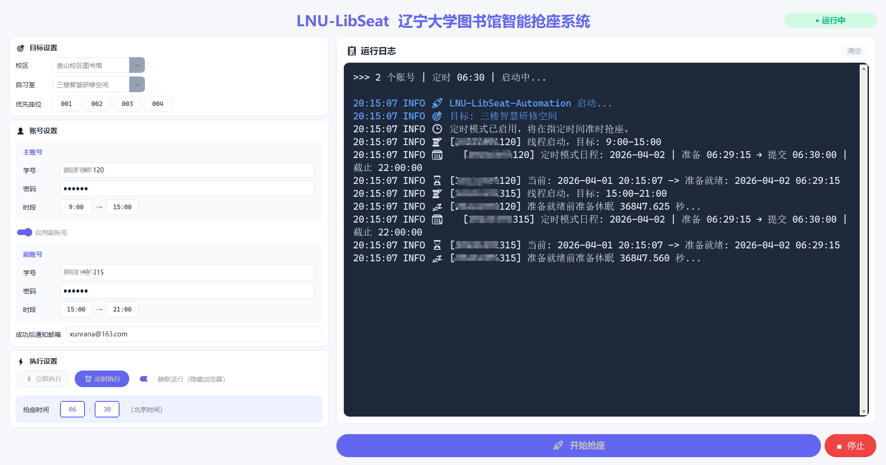
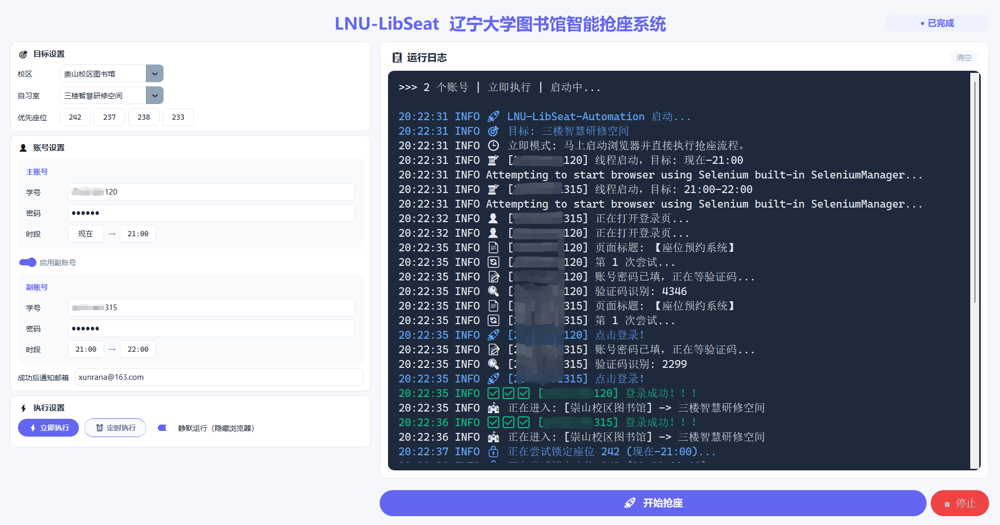
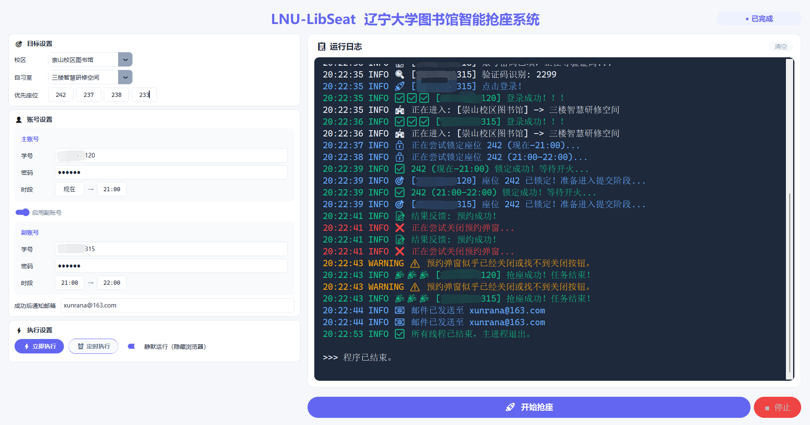
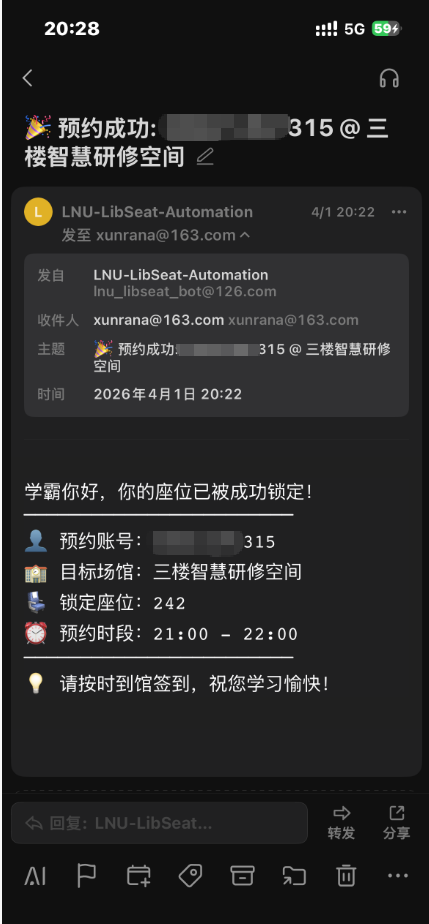

# LNU-LibSeat-Automation

> **辽宁大学图书馆座位预约自动化工具** — 快速、精准地抢占目标自习室座位

[](https://python.org)
[](https://selenium.dev)
[](#版权与许可)
[](https://github.com/XUNRANA/LNU-LibSeat-Automation/releases/latest)

---

## ✨ 特性

- 🖥️ **现代化图形界面** — CustomTkinter Indigo 主题，卡片式布局
- 🧵 **多线程并发** — 多账号同时运行，分时段分工
- 🎯 **全自习室地毯式扫描** — 首选座位按优先级尝试，失败后自动随机扫描该自习室**剩余全部座位**，双校区 20 间自习室全覆盖
- 🔐 **验证码双引擎** — 图鉴 API（商业级）+ ddddocr（本地兜底），双保险点击策略（ActionChains + JS 补点）
- ⏱️ **精确卡点** — 提前 30s 启动浏览器 → 提前 6s 锁定座位 → 整点准时提交
- 🎯 **单会话深度重试** — API 5 次 / 本地 OCR 10 次，逐个座位深度尝试
- 🎥 **浏览器全程录屏** — MP4 录制，方便复盘
- 📁 **会话级可追溯** — 每次抢座独立文件夹：日志 + 截图 + 录屏 + 抢座顺序清单
- 📧 **邮件通知** — 抢座成功后自动发送战报
- 🌐 **Edge / Chrome 双支持** — 驱动自动下载
- 📦 **EXE 免安装分发** — 下载即用，无需 Python

---

## 📸 真实效果展示

### GUI 主界面 — 定时模式（双账号分时段挂机）



### 立即执行 — 自动登录 + 验证码识别 + 选座全流程



### 抢座成功 — 双账号同时锁定 + 邮件通知



### 手机即时收到成功通知邮件

<p align="center">
  
</p>

---

## 🚨 重要警告：合理使用，切勿滥用！

> ⚠️ **请务必准时到馆签到！** 连续或 7 天内累计 3 次违约，将被列入黑名单 7 天！

---

## ⚡ 快速开始

### 📋 运行环境要求

1. **操作系统**：Windows 10 / 11。
2. **浏览器**：Microsoft Edge 或 Google Chrome（程序内置自动驱动匹配）。
3. **网络畅通**：能正常打开座位预约系统。

> ❌ **不需要** Python、环境变量、命令行等任何额外配置。

### 方式一：下载 EXE（推荐）

1. 前往 [Releases](https://github.com/XUNRANA/LNU-LibSeat-Automation/releases/latest) 下载 `LNU-LibSeat-v3.0.0.zip`
2. 解压 → 双击 `LNU-LibSeat.exe`
3. GUI 填写信息 → 点击开始

### 方式二：Python 源码运行

```powershell
git clone https://github.com/XUNRANA/LNU-LibSeat-Automation
cd LNU-LibSeat-Automation
run.bat
```

> 📖 详细教程见 **[快速上手指南](docs/QUICKSTART.md)**

---

## 📖 使用指南

- 🎯 **目标配置**：选校区、自习室，填最多 10 个首选座位号。**一个不填也行**，系统会随机扫描该自习室全部座位。
- 👤 **账号**：学号 + 密码（初始密码 `000000`）。
- ⚠️ 结束时间**必须填整点**（如 `15:00`），否则系统不认。
- 📧 填邮箱即可收到成功通知。
- ⚙️ 「立即执行」或「定时执行」——定时模式建议填次日 6:30。
- 🔐 「图鉴API抢座」开关：开启后全天使用商业级 API（更准），关闭则仅高峰期使用。

---

## 📁 项目结构

```
LNU-LibSeat-Automation/
├── gui.py                   # 🖥️ GUI 入口
├── main.py                  # 多线程调度 + 单会话策略引擎
├── config.py                # ⚙️ 配置文件（GUI 自动生成）
├── run.bat                  # 一键启动
├── build.py                 # 📦 PyInstaller 打包
├── info/                    # 📋 双校区 20 间自习室座位索引
├── core/                    # 🛠️ 基础设施层
│   ├── driver.py            #   WebDriver 管理
│   ├── captcha.py           #   本地 ddddocr 验证码引擎
│   ├── captcha_api.py       #   图鉴 (TTShiTu) API 客户端
│   ├── screen_recorder.py   #   浏览器录屏
│   ├── logger.py            #   日志系统
│   ├── notifications.py     #   SMTP 邮件
│   └── utils.py             #   时间工具
├── logic/                   # 🧠 业务逻辑层
│   ├── auth.py              #   自动登录
│   ├── navigator.py         #   校区/自习室切换
│   └── booker.py            #   选座 + 验证码 + 提交 + 结果检测
├── tests/                   # 🧪 测试
└── docs/                    # 📖 文档
```

## 📖 文档导航

| 文档 | 说明 |
|------|------|
| [快速上手](docs/QUICKSTART.md) | 从零开始的完整使用教程 |
| [配置详解](docs/CONFIGURATION.md) | config.py 各字段说明 |
| [架构文档](docs/ARCHITECTURE.md) | 架构设计、模块关系、开发者指南 |

---

## 📦 打包（开发者）

```powershell
python build.py
```

> `build.py` 自动创建隔离 venv，打包后清理。输出 `dist/LNU-LibSeat-v3.0.0/` + ZIP。

---

## 🏛️ 辽大图书馆预约规则

- 预约方式：`libseat.lnu.edu.cn` / 微信 / 到馆刷卡
- 登录：校园卡号，初始密码 `000000`
- 签到：提前 30 分钟至迟到 30 分钟
- 每日 ≤ 3 次预约，每次 ≤ 6 小时，≤ 3 次取消
- 放座时间：每日 6:30
- 🚫 7 天内 3 次违约 → 黑名单 7 天

---

## ⚠️ 免责声明

本项目仅供**技术交流与学习**，请严格遵守学校图书馆规定。**所有后果由使用者自行承担。**

## 📄 许可

MIT License

---

## ☕ 赞助支持（求赞助！！！）

> ⚠️ **图鉴 API 按次计费：0.016 元/次**，每次识别无论成败都会扣费。高峰期每个账号可能消耗数十次调用，全靠作者自掏腰包维持。
>
> 如果使用人数持续增长，资金紧张的话，**免费 API 可能随时停止**，届时每个人需要用**自己的图鉴账号购买积分**才能继续使用。
>
> 如果这个项目帮到了你，**求赞助支持** ☕ 你的每一分钱都直接用于 API 调用费用，让这个项目能持续免费运行下去！

<p align="center">
  &nbsp;&nbsp;&nbsp;&nbsp;&nbsp;&nbsp;&nbsp;&nbsp;&nbsp;&nbsp;&nbsp;&nbsp;&nbsp;&nbsp;&nbsp;&nbsp;&nbsp;&nbsp;&nbsp;&nbsp;&nbsp;&nbsp;&nbsp;&nbsp;&nbsp;&nbsp;&nbsp;&nbsp;&nbsp;&nbsp;&nbsp;&nbsp;
  
</p>
<p align="center">
  <b>支付宝</b>&nbsp;&nbsp;&nbsp;&nbsp;&nbsp;&nbsp;&nbsp;&nbsp;&nbsp;&nbsp;&nbsp;&nbsp;&nbsp;&nbsp;&nbsp;&nbsp;&nbsp;&nbsp;&nbsp;&nbsp;&nbsp;&nbsp;&nbsp;&nbsp;&nbsp;&nbsp;&nbsp;&nbsp;&nbsp;&nbsp;&nbsp;&nbsp;&nbsp;&nbsp;&nbsp;&nbsp;&nbsp;&nbsp;&nbsp;&nbsp;&nbsp;&nbsp;&nbsp;&nbsp;&nbsp;&nbsp;&nbsp;&nbsp;&nbsp;&nbsp;&nbsp;&nbsp;&nbsp;&nbsp;&nbsp;&nbsp;&nbsp;&nbsp;&nbsp;&nbsp;&nbsp;&nbsp;&nbsp;&nbsp;&nbsp;&nbsp;&nbsp;&nbsp;<b>微信支付</b>
</p>
