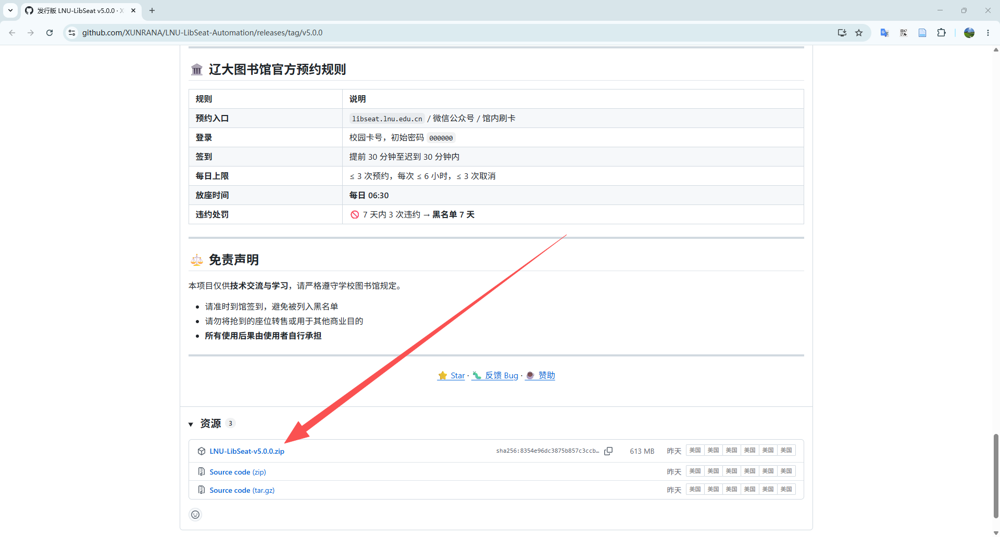
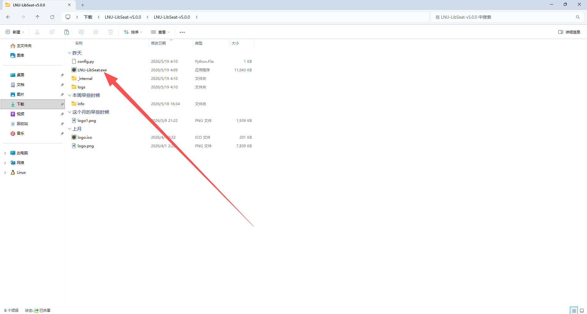
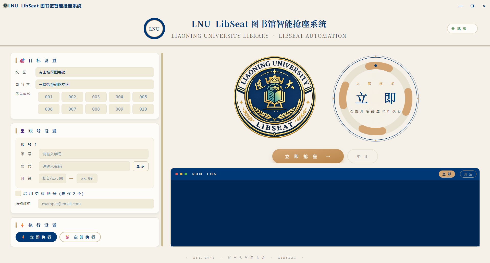
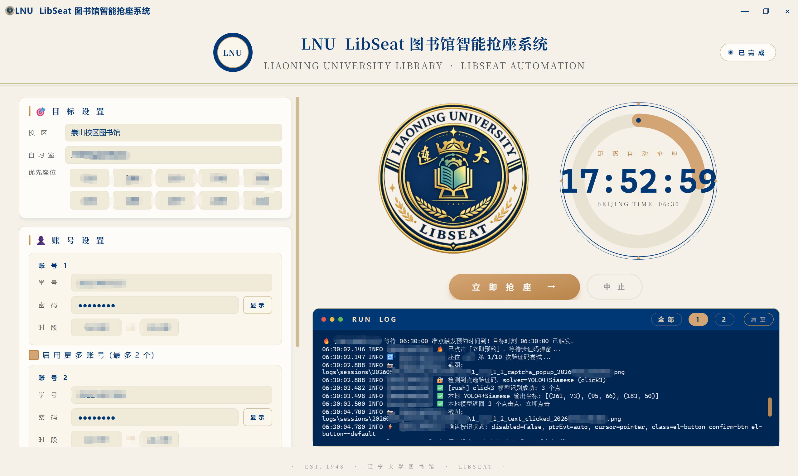
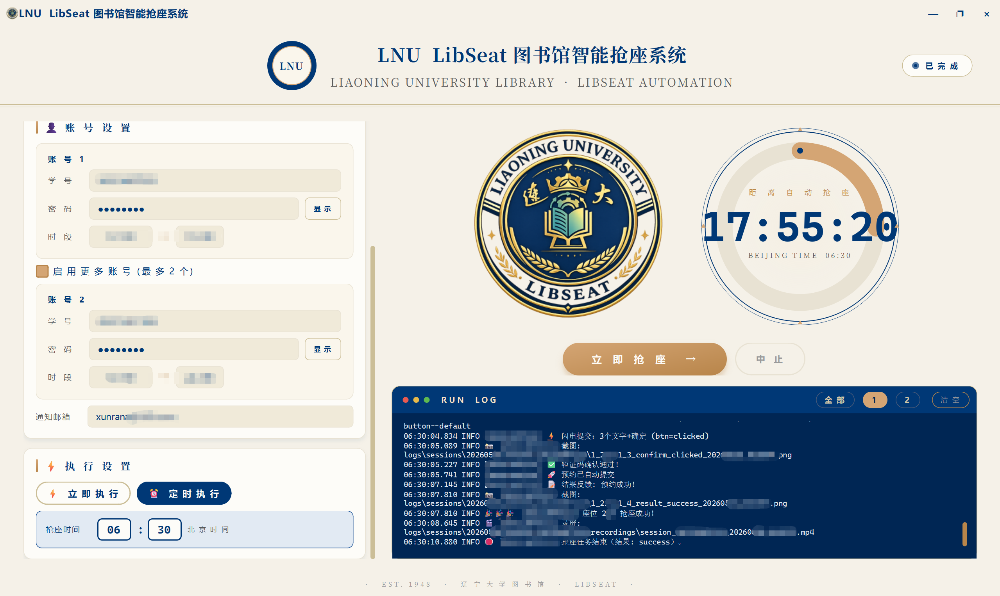
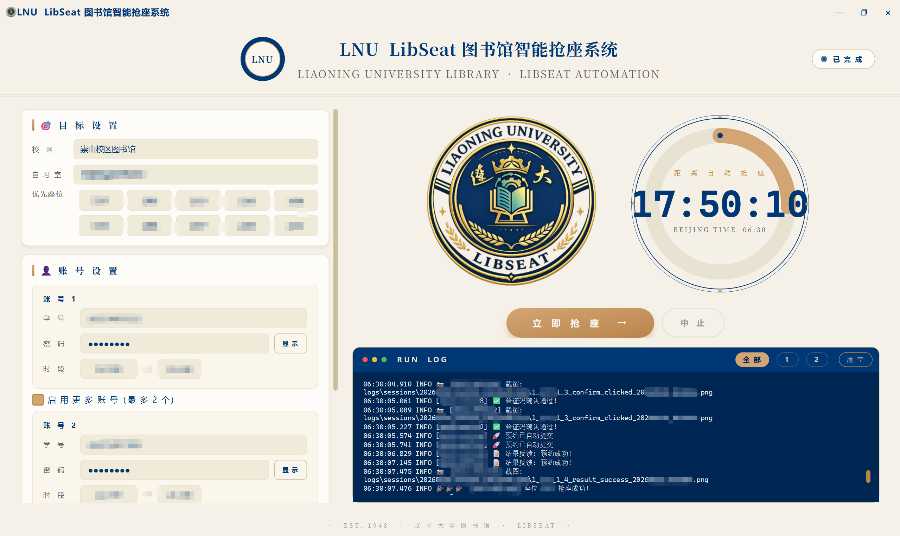
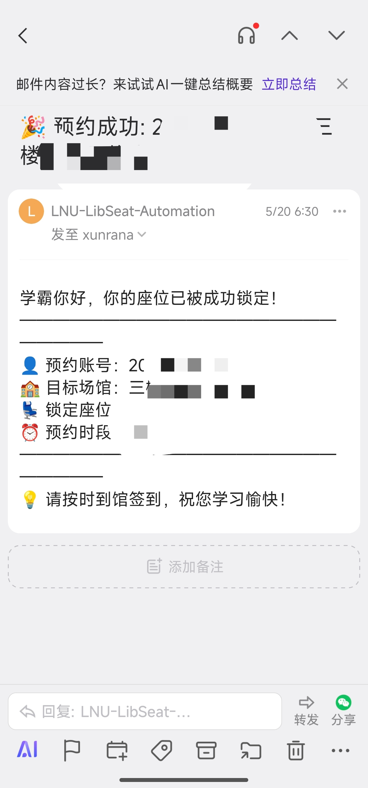

<div align="center">

<table border="0" cellpadding="0" cellspacing="0">
<tr>
<!-- Logo -->
<td width="250" align="center" valign="middle">

</td>
<!-- 标题 + 标语 + 徽章 -->
<td colspan="3" valign="middle" padding-left="10">

<h1 align="left">LNU-LibSeat</h1>

<h3 align="left">🎯 辽宁大学图书馆 · 智能抢座神器 · v5.0.0</h3>

<p align="left"><strong>6:30 它替你抢座 · 整点零延迟提交 · 自研 AI 识别 · 邮件秒达战报</strong></p>

<p align="left">
<a href="https://python.org"></a>
<a href="https://doc.qt.io/qtforpython-6/"></a>
<a href="https://onnxruntime.ai/"></a>
<a href="https://selenium.dev"></a>
<a href="https://github.com/XUNRANA/LNU-LibSeat-Automation/releases/latest"></a>
<a href="#-免责声明"></a>
<a href="https://github.com/XUNRANA/LNU-LibSeat-Automation"></a>
</p>

</td>
</tr>
<!-- 统计数据行 -->
<tr>
<td align="center" width="250" height="160"><h1>🧠</h1>自研 YOLO4+Siamese<br>本地识别</td>
<td align="center" width="250" height="160"><h1>83.48%</h1>Click1 端到端准确率</td>
<td align="center" width="250" height="160"><h1>21 间</h1>双校区自习室全覆盖</td>
<td align="center" width="250" height="160"><h1>0 元</h1>你的使用成本</td>
</tr>
</table>

</div>

---

> [!IMPORTANT]
> ✨ **v5.0.0 重磅升级！** 全新 PySide6 界面、自研验证码 AI、模型预加载——告别付费 API。
> 详见 [v5.0.0 升级日志](docs/RELEASE_NOTES_V5.md) · 老用户看 [v3→v5 升级指南](docs/MIGRATION_V3_TO_V5.md)。

> [!WARNING]
> 🛡️ **准时到馆签到！** 连续或 7 天内累计 **3 次违约 = 黑名单 7 天**，所有账号都不能预约。

> [!TIP]
> 第一次用？跳到 [§ 三步开始](#-三步开始30-秒上手) 30 秒搞定。

---

## 🎯 这是什么

一个**双击即用**的 Windows 桌面工具，帮你在辽大图书馆每天 **06:30 放座**的瞬间完成：

登录 → 进自习室 → 锁定座位 → 识别验证码 → 提交预约 → 邮件通知。**不用装 Python，不用懂代码。**

### 适合谁用？

<table width="1000">
<tr>
<td align="center" width="333">
<h2>🎓 普通学生</h2>
不想 6:30 起床抢座<br>
想要每天稳定占到心仪的位置
</td>
<td align="center" width="333">
<h2>📚 考研党 / 自习党</h2>
全天候图书馆挂机<br>
双账号分时段无缝衔接 9:00-21:00
</td>
<td align="center" width="333">
<h2>🌙 错峰玩家</h2>
6:30 准时抢座<br>
冷门座位成功率 100%
</td>
</tr>
</table>

---

## ⚖️ 手动 vs LNU-LibSeat

<table width="1000">
<tr><th align="left" width="250">抢座环节</th><th align="left" width="375">😩 手动操作</th><th align="left" width="375">⚡ LNU-LibSeat v5</th></tr>
<tr><td><b>6:30 起床</b></td><td>必须，闹钟 5 个</td><td>❌ 不用，程序定时唤醒</td></tr>
<tr><td><b>验证码识别</b></td><td>眼花点 5 次还点不准</td><td>🧠 自研 AI <b>&lt; 1s</b> 识别</td></tr>
<tr><td><b>抢座失败重试</b></td><td>手动刷新→重选→重做验证码</td><td>✅ 自动换座 + 自动重做</td></tr>
<tr><td><b>不填座位号</b></td><td>不可能，必须挑一个</td><td>⚠️ 至少填 1 个首选，程序自动兜底扫剩余全部</td></tr>
<tr><td><b>双账号同时抢</b></td><td>物理开两个浏览器</td><td>✅ 多线程并发（最多 2 账号）</td></tr>
<tr><td><b>整点零延迟提交</b></td><td>你最快也比 06:30:00 慢 1-3 秒</td><td>✅ 程序毫秒级精度</td></tr>
<tr><td><b>抢中后通知</b></td><td>自己刷新页面看</td><td>📧 邮件秒达手机</td></tr>
<tr><td><b>出问题排查</b></td><td>完全靠回忆</td><td>📁 录屏 + 4 阶段截图 + 日志</td></tr>
<tr><td><b>付费 OCR 依赖</b></td><td>—</td><td>❌ 已无（v5 本地推理免费）</td></tr>
</table>

---

## 🚀 三步开始（30 秒上手）

<table width="1000">
<tr>
<td align="center" width="333">
<h3>① 下载</h3>
<a href="https://github.com/XUNRANA/LNU-LibSeat-Automation/releases/latest">

</a>
<p>去 <a href="https://github.com/XUNRANA/LNU-LibSeat-Automation/releases/latest">Releases</a> 下载<br><code>LNU-LibSeat-v5.0.0-Windows-x86_64.zip</code></p>
</td>
<td align="center" width="333">
<h3>② 解压 → 双击</h3>

<p>解压到任意位置<br>双击 <code>LNU-LibSeat.exe</code></p>
</td>
<td align="center" width="333">
<h3>③ 填表 → 开始</h3>

<p>填学号密码 + 时段<br>点「🚀 开始抢座」</p>
</td>
</tr>
</table>

> [!NOTE]
> ❌ **不需要** Python、命令行、环境变量、手动下驱动——所有依赖都打包进 exe 了。
>
> ✅ 唯一前提：Windows 10/11 + 装了 Edge 或 Chrome（任意较新版本即可）。

---

## 🍎 macOS 用户（Intel & Apple 芯片）

Mac 双击不了 `.exe`，请下载 macOS 专版 `.app`：

1. 去 [Releases](https://github.com/XUNRANA/LNU-LibSeat-Automation/releases/latest) 下载 `LNU-LibSeat-v5.0.0-macOS-x86_64.zip`。
2. 解压后，**右键**点击 `首次运行请先双击我.command` → 「打开」→ 再点一次「打开」。
   - 应用未做苹果付费签名，首次必须用右键打开以解除安全限制；之后可直接双击 `LNU-LibSeat.app`。
   - 若提示「无法打开」，到 **系统设置 ▸ 隐私与安全性 ▸ 仍要打开**。
3. 装好 **Google Chrome**（默认驱动，支持双账号并行），填表 →「开始抢座」。

> [!NOTE]
> - **支持所有 Mac**：Intel 芯片**原生运行**；Apple 芯片（M1/M2/M3/M4…）首次启动会**自动通过 Rosetta 2 运行**——系统弹窗点一下装好 Rosetta 即可。
> - **浏览器**：默认 Chrome；也可在应用内「浏览器」下拉选 Safari（需先开启 Safari ▸ 设置 ▸ 高级 ▸ 显示开发菜单 ▸ 开发 ▸ 允许远程自动化），但 Safari 仅支持**单账号**、不支持双账号并行。
> - **数据位置**：`config.py`、`logs/` 在解压文件夹内、与 `.app` 同级，可直接查看 / 编辑。
> - **屏幕录制**：此功能在 macOS 上可能不可用（不影响抢座）。

---

## 💎 v5.0.0 核心特色

<table width="1000">
<tr>
<td width="333" valign="top">
<h3>🧠 自研验证码 AI</h3>
<b>YOLO4 检测 + Siamese 相似度</b>双阶段管线，本地 ONNX 推理，告别付费 API。<br>
Click1 端到端 <b>83.48%</b> 准确率，单次 &lt; 1s。
</td>
<td width="333" valign="top">
<h3>🎨 PySide6 全新界面</h3>
<b>Qt 原生渲染</b>，高分屏一致体验。<br>
模块化拆分：<code>panels/</code> + <code>widgets/</code> + <code>workers/</code> + <code>services/</code>，<b>23 个</b>组件解耦。
</td>
<td width="333" valign="top">
<h3>🧊 模型预加载</h3>
启动 GUI 后<b>后台异步预热</b> ONNX 模型，避免 6:30 第一次验证码冷启动。<br>
3-5s 预加载完成，整点出招毫秒级。
</td>
</tr>
<tr>
<td width="333" valign="top">
<h3>🎯 全自习室扫描</h3>
首选座位失败后<b>自动随机扫描</b>该自习室剩下的座位，双校区 <b>21 间</b>自习室全覆盖（v5 新增「智慧空间」+281 座位）。
</td>
<td width="333" valign="top">
<h3>📁 会话级追溯</h3>
每次抢座生成独立目录：<b>session.log + 4 阶段截图 + MP4 录屏 + 抢座顺序清单</b>。<br>
出问题打包文件夹就能上报。
</td>
<td width="333" valign="top">
<h3>⏱️ 毫秒级精确卡点</h3>
提前 30s 启动浏览器 → 提前 6s 锁定座位 → 整点 06:30:02 提交（<code>time.sleep(2)</code> 等服务端切状态）。<br>
多账号通过 <code>slot_index × 8s</code> 偏移避免资源争抢。
</td>
</tr>
<tr>
<td width="333" valign="top">
<h3>🧵 双账号多线程</h3>
两个学号<b>同时跑</b>（<code>MAX_ACCOUNTS=2</code>），分时段无缝衔接（如 9:00-15:00 + 15:00-21:00 = 全天覆盖）。
</td>
<td width="333" valign="top">
<h3>🛡️ 黑名单立即停止</h3>
检测到「对不起，您已被加入黑名单...」固定文本后<b>立刻退出会话</b>，避免重试加重处罚。
</td>
<td width="333" valign="top">
<h3>📧 邮件通知</h3>
抢座成功自动发战报到你邮箱：座位号 / 时段 / 自习室一应俱全。
</td>
</tr>
</table>

---

## 🎬 实战截图秀

### 立即执行 — 自动登录 + 验证码识别 + 选座全流程


### 定时模式 — 双账号分时段挂机

- **06:30:00 启动抢座**：
  
- **06:30:02 验证码识别与提交**：
  
- **06:30:05 预约成功**：
  

### 手机即时收到成功通知邮件

<p align="center">
  
</p>

---

## 🧠 v5 验证码引擎：YOLO4 + Siamese

> v5.0.0 取代了 v3 的「图鉴 API + ddddocr」双引擎，全面切到自研本地模型。完整技术细节见 [CAPTCHA_YOLO4_SIAMESE.md](docs/CAPTCHA_YOLO4_SIAMESE.md)。

### 工作原理

```
DOM 抓图 → base64 解码
        ↓
   YOLO4 检测层（core/yolo_onnx.py）
        ↓ 输出 4 个候选框（置信度 0.05+）
   Siamese 相似度层
        ↓ 与目标字符 crop 对比 112×112 输入
   Top-K 排序 → 点击坐标
        ↓
   ActionChains 点击 + JS 兜底
```

### 关键设计

<table width="1000">
<tr>
<td width="500" valign="top">
<h4>⏰ 时间窗口</h4>
本地模型仅在 <b>06:30:00 – 06:35:00</b> 5 分钟激活窗口内启用。<br>
窗口外：直接关闭验证码弹窗换座，节省 CPU。<br>
<code>logic/booker.py:LOCAL_CAPTCHA_WINDOW_START/END</code>
</td>
<td width="500" valign="top">
<h4>🔒 线程安全</h4>
模块级锁 <code>_CAPTCHA_SOLVER_LOCK</code> + 全局标志 <code>_YOLO4_SIAMESE_PRELOADED</code>，<br>
多账号并发推理安全无竞争。
</td>
</tr>
<tr>
<td width="500" valign="top">
<h4>📦 模型权重</h4>
<code>core/checkpoints/</code> 共 <b>7 个文件</b> (~210MB)：<br>
- 4 个 ONNX（运行时）<br>
- 2 个 PT + 1 个 PTH（源码，可重训）
</td>
<td width="500" valign="top">
<h4>🧠 自训练支持</h4>
<code>siamese_dataloader.py</code> + <code>siamese_model.py</code><br>
基于 MobileNetV4-Conv-Medium + 自定义融合头<br>
特征维度 1280，融合层 5120→512→128→1
</td>
</tr>
</table>

### v3 vs v5 性能对比

| 指标 | v3 图鉴 API | v3 ddddocr | **v5 YOLO4+Siamese** |
|------|-------------|------------|----------------------|
| 单次识别延迟 | 7.21s | 0.51s | 待回测（预计 < 1s） |
| 单次准确率 | 100% | 61.2% | **Click1 83.48%**（端到端） |
| 累计 5 次内通过率 | 100% | 100% | 待回测 |
| 联网依赖 | ✅ 强 | ❌ 无 | ❌ 无 |
| 单次成本 | 0.016 元 | 0 元 | 0 元 |

完整 v5 实测数据：[V5_PERFORMANCE.md](docs/V5_PERFORMANCE.md)。

---

## ☕ 求赞助 — 支持持续开发

> [!NOTE]
> v5.0.0 让 LNU-LibSeat 彻底摆脱了商业 API 的成本压力。
> 但作者仍在为大家**维护、训练新模型、修 bug**——
> **随手扫码赞助**就是最大的鼓励 ❤️

<table align="center" border="0" cellspacing="0">
<tr>
<td width="300" align="center" valign="middle">
  <b>☕ 你的赞助将用于</b><br>
  <b>模型训练 · 测试</b><br>
  <sub>让免费持续 ❤️</sub>
</td>
<td align="center"><br><b>微信支付</b></td>
</tr>
</table>

---

## 🛟 高频 FAQ

<details>
<summary><b>Q1: 我一点 Python 都不懂，能用吗？</b></summary>

✅ 完全没问题。下载 [Releases](https://github.com/XUNRANA/LNU-LibSeat-Automation/releases/latest) 里的 zip，解压双击 exe 即可。**全程不需要打开任何代码编辑器**。
</details>

<details>
<summary><b>Q2: v5 的验证码识别要联网吗？要不要付费？</b></summary>

❌ **完全不需要联网，零付费**。

v5 切换到自研 **YOLO4+Siamese 本地模型**，权重内置在 exe 的 `_internal/core/checkpoints/` 下（~210MB）。

⏰ 模型仅在 **06:30:00–06:35:00** 自动启用——其他时段不识别验证码（节省 CPU）。错峰抢座请见 [CAPTCHA_YOLO4_SIAMESE.md](docs/CAPTCHA_YOLO4_SIAMESE.md)。
</details>

<details>
<summary><b>Q3: 抢座失败了怎么排查？</b></summary>

打开 `logs/sessions/<时间戳>_<学号>/` 文件夹，里面有：
- `session.log` — 仅本次会话的完整日志
- `抢座顺序.txt` — 这次准备试哪些座位
- `*_1_captcha_popup_*.png` — 验证码弹窗截图
- `*_2_text_clicked_*.png` — 点击文字后截图
- `*_3_confirm_clicked_*.png` — 点击确定后截图
- `*_4_result_*.png` — 结果截图
- `recordings/*.mp4` — 全程录屏

把这个文件夹打包发给作者就行，比口头描述清楚 100 倍。
</details>

<details>
<summary><b>Q4: 电脑会被休眠吗？10 小时挂机靠谱吗？</b></summary>

🛡️ 不会。GUI 启动时通过 `ui_qt/services/prevent_sleep.py` 自动调用 `SetThreadExecutionState` 申请系统唤醒权限，**全程禁止系统休眠**——支持 10 小时以上挂机不断网。每 30 秒发送一次防休眠信号，60 秒空闲自动鼠标抖动。
程序结束后自动恢复正常休眠策略。
</details>

<details>
<summary><b>Q5: 怎么做到每天自动跑（无人值守）？</b></summary>

用 Windows 任务计划程序：
1. Win+R → `taskschd.msc`
2. 创建基本任务，触发器设**每天 00:15**（程序内部会自己等到 06:29:30 再启动浏览器）
3. 操作选 `LNU-LibSeat.exe`
4. 勾选**「唤醒计算机以运行此任务」**

之后电脑就算睡眠也能定时醒来抢座。
</details>

<details>
<summary><b>Q6: 我是 v3 老用户，要怎么升 v5？</b></summary>

看 [v3→v5 升级指南](docs/MIGRATION_V3_TO_V5.md)。
- **EXE 用户**：下新 zip 解压，3 分钟搞定
- **源码用户**：`git pull` + `pip uninstall customtkinter` + `pip install -r requirements.txt` + `python gui_qt.py`
</details>

<details>
<summary><b>Q7: GUI 启动后日志有「模型预加载」字样是正常的吗？</b></summary>

✅ 完全正常。v5 启动 GUI 后立即在后台异步预热 YOLO4+Siamese 模型（约 3-5s），避免抢座时刻冷启动延迟。不阻塞你填表 / 点开始按钮。
</details>

---

## 📖 文档导航

<table width="1000">
<tr>
<td align="center" width="250">
<h3>📘</h3>
<a href="docs/QUICKSTART.md"><b>快速上手</b></a><br>
<sub>从零开始的完整使用教程</sub>
</td>
<td align="center" width="250">
<h3>🚀</h3>
<a href="docs/MIGRATION_V3_TO_V5.md"><b>v3→v5 升级指南</b></a><br>
<sub>老用户必读</sub>
</td>
<td align="center" width="250">
<h3>📦</h3>
<a href="docs/RELEASE_NOTES_V5.md"><b>v5.0.0 升级日志</b></a><br>
<sub>3 大重构 + 6 项强化</sub>
</td>
<td align="center" width="250">
<h3>⚙️</h3>
<a href="docs/CONFIGURATION.md"><b>配置详解</b></a><br>
<sub>config.py 各字段说明</sub>
</td>
</tr>
<tr>
<td align="center" width="250">
<h3>🏗️</h3>
<a href="docs/ARCHITECTURE.md"><b>架构文档</b></a><br>
<sub>开发者向：模块 / 流程 / 决策</sub>
</td>
<td align="center" width="250">
<h3>🧠</h3>
<a href="docs/CAPTCHA_YOLO4_SIAMESE.md"><b>验证码引擎</b></a><br>
<sub>YOLO4+Siamese 技术细节</sub>
</td>
<td align="center" width="250">
<h3>🎨</h3>
<a href="docs/GUI_QT_ARCHITECTURE.md"><b>GUI 架构</b></a><br>
<sub>PySide6 模块拆分</sub>
</td>
<td align="center" width="250">
<h3>🔀</h3>
<a href="docs/BOOKING_FLOWCHART.md"><b>抢座流程图</b></a><br>
<sub>11 张 Mermaid 流程图</sub>
</td>
</tr>
<tr>
<td align="center" width="250">
<h3>💬</h3>
<a href="docs/FEEDBACK_MESSAGES.md"><b>反馈消息</b></a><br>
<sub>系统反馈 → 程序行为映射</sub>
</td>
<td align="center" width="250">
<h3>🔢</h3>
<a href="docs/NUMERIC_PARAMETERS.md"><b>数字参数</b></a><br>
<sub>所有超时/延迟/阈值清单</sub>
</td>
<td align="center" width="250">
<h3>📊</h3>
<a href="docs/V5_PERFORMANCE.md"><b>v5 性能基准</b></a><br>
<sub>实测数据 / 对比表</sub>
</td>
<td align="center" width="250">
<h3>📜</h3>
<a href="docs/RELEASE_NOTES.md"><b>v3.0.0 历史</b></a><br>
<sub>历史 release notes</sub>
</td>
</tr>
</table>

---

## 🛠️ 开发者：从源码运行 / 自己打包

<details>
<summary><b>Python 源码运行</b></summary>

```powershell
git clone https://github.com/XUNRANA/LNU-LibSeat-Automation
cd LNU-LibSeat-Automation
.\run.bat        # 首次运行会自动创建 venv 并装依赖
```

或手动：

```powershell
python -m venv .venv
.\.venv\Scripts\activate
pip install -r requirements.txt
python gui_qt.py        # v5 入口（v3 是 gui.py）
```
</details>

<details>
<summary><b>PyInstaller 打包：Windows（.exe）/ macOS（.app）</b></summary>

**Windows（产出 `.exe`）：**

```powershell
python build.py
```

`build.py` 会自动创建一个隔离的临时 venv，仅安装 PySide6 / selenium / onnxruntime / ddddocr 等必需依赖，打包后清理。

输出：
- `dist/LNU-LibSeat-v5.0.0/` — 可分发的完整文件夹
- `dist/LNU-LibSeat-v5.0.0.zip` — 上传 GitHub Release 时改名为 `LNU-LibSeat-v5.0.0-Windows-x86_64.zip`

**macOS（产出 `.app`，必须在 Mac 上运行）：**

```bash
python3 build_mac.py
```

PyInstaller 不能跨平台编译——`.app` 只能在 macOS 上构建（本地 Mac，或 GitHub Actions 的 `macos-14` runner）。仓库已内置 `.github/workflows/build-macos.yml`：推送 `v*` 标签会自动在云端构建并把 `*-macOS-*.zip` 挂到对应 Release。产物 `dist/LNU-LibSeat-v5.0.0-macOS-<arch>.zip` 内含 `.app` + 外置可编辑 `config.py` + `info/` + `首次运行请先双击我.command` + 使用说明。
</details>

<details>
<summary><b>项目结构（v5）</b></summary>

```
LNU-LibSeat-Automation/
├── gui_qt.py                   # 🖥️ GUI 入口（PySide6，8 行）
├── ui_qt/                      # 🎨 GUI 模块（23 个文件）
│   ├── app.py                  #   MainWindow
│   ├── theme.py                #   全局主题
│   ├── panels/                 #   ConfigPanel + DashboardPanel
│   ├── widgets/                #   11 个复用组件
│   ├── workers/                #   后台 Worker 线程
│   └── services/               #   配置 I/O + 防休眠
├── main.py                     # 多线程调度 + 单浏览器会话策略
├── config.py                   # ⚙️ 配置（GUI 自动生成）
├── run.bat                     # 一键启动
├── build.py                    # 📦 PyInstaller 打包
├── requirements.txt            # PySide6 / onnxruntime / selenium / ddddocr ...
├── info/                       # 📋 双校区 21 间自习室座位索引
│   └── 智慧空间.txt            #   ← v5 新增（蒲河校区）
├── core/                       # 🛠️ 基础设施层
│   ├── driver.py               #   WebDriver 管理
│   ├── captcha.py              #   ddddocr 登录验证码（保留）
│   ├── captcha_yolo4_siamese.py        # 🆕 Click3 求解
│   ├── captcha_click1_yolo4_siamese.py # 🆕 Click1 求解
│   ├── yolo_onnx.py            # 🆕 ONNX 通用推理
│   ├── checkpoints/            # 🆕 7 个模型权重 (~210MB)
│   ├── captcha_api.py          #   图鉴 API（保留备份，默认不用）
│   ├── screen_recorder.py      #   浏览器录屏
│   ├── logger.py               #   日志系统
│   ├── notifications.py        #   SMTP 邮件
│   └── utils.py                #   时间工具
├── logic/                      # 🧠 业务逻辑层
│   ├── auth.py                 #   自动登录
│   ├── navigator.py            #   校区/自习室切换
│   └── booker.py               #   选座 + 验证码 + 提交 + 结果检测
├── siamese_dataloader.py       # 🧪 训练用（运行时不需要）
├── siamese_model.py            # 🧪 训练用（运行时不需要）
└── docs/                       # 📖 文档
```
</details>

---

## 🏛️ 辽大图书馆官方预约规则

<table width="1000">
<tr><th align="left" width="250">规则</th><th align="left" width="750">说明</th></tr>
<tr><td><b>预约入口</b></td><td><code>libseat.lnu.edu.cn</code> / 微信公众号 / 馆内刷卡</td></tr>
<tr><td><b>登录</b></td><td>校园卡号，初始密码 <code>000000</code></td></tr>
<tr><td><b>签到</b></td><td>提前 30 分钟至迟到 30 分钟内</td></tr>
<tr><td><b>每日上限</b></td><td>≤ 3 次预约，每次 ≤ 6 小时，≤ 3 次取消</td></tr>
<tr><td><b>放座时间</b></td><td><b>每日 06:30</b></td></tr>
<tr><td><b>违约处罚</b></td><td>🚫 7 天内 3 次违约 → <b>黑名单 7 天</b></td></tr>
</table>

---

## ⚖️ 免责声明

本项目仅供**技术交流与学习**，请严格遵守学校图书馆规定。
- 请准时到馆签到，避免被列入黑名单
- 请勿将抢到的座位转售或用于其他商业目的
- **所有使用后果由使用者自行承担**

## 🙏 致谢

本项目站在两位前人的肩膀上完成，特别感谢：

- **[geTiger/get_LibSeat](https://github.com/geTiger/get_LibSeat)** — 辽宁大学图书馆抢座的最早开源实现，本项目最初的抢座流程、表单字段、接口调用思路均参考自此项目。没有 geTiger 的开源，这个项目可能根本不会出现。
- **[MgArcher/Text_select_captcha](https://github.com/MgArcher/Text_select_captcha)** — 文字点选验证码识别的开源方案，本项目自研的 **YOLO + Siamese 双阶段管线**（[`core/captcha_yolo4_siamese.py`](core/captcha_yolo4_siamese.py)）的整体架构、`Siamese MobileNetV4` 模型设计、`plan + bg` 合成图训练范式都源自这个项目。v5.0.0 能彻底告别付费 API、走纯本地 ONNX 推理，要把最大的一份感谢给 MgArcher。

如果你觉得本项目有用，**也请去给上面两个仓库点个 Star** ⭐。

## 📄 License

[MIT](https://opensource.org/licenses/MIT) © XUNRANA

---

<div align="center">

**如果这个项目帮到了你，请给个 ⭐ Star 鼓励作者持续维护！**

[⭐ 给项目加星](https://github.com/XUNRANA/LNU-LibSeat-Automation) · [☕ 赞助一杯奶茶](#-求赞助--支持持续开发) · [🐛 反馈 Bug](https://github.com/XUNRANA/LNU-LibSeat-Automation/issues) · [📦 v5.0.0 升级日志](docs/RELEASE_NOTES_V5.md)

</div>
