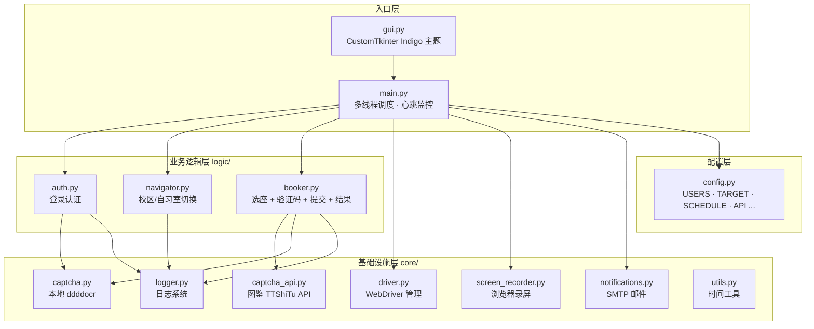
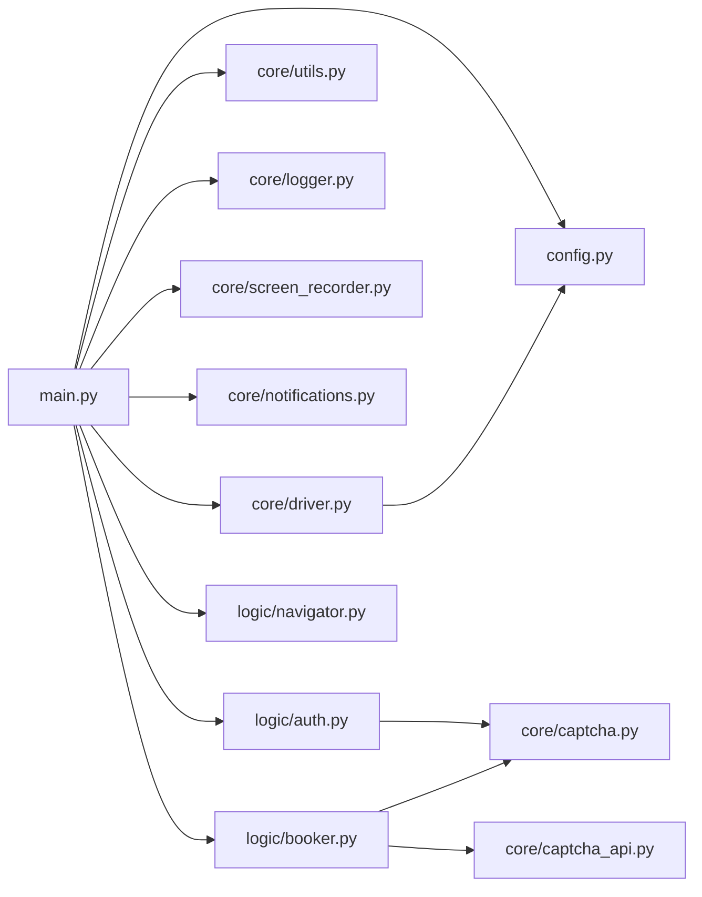
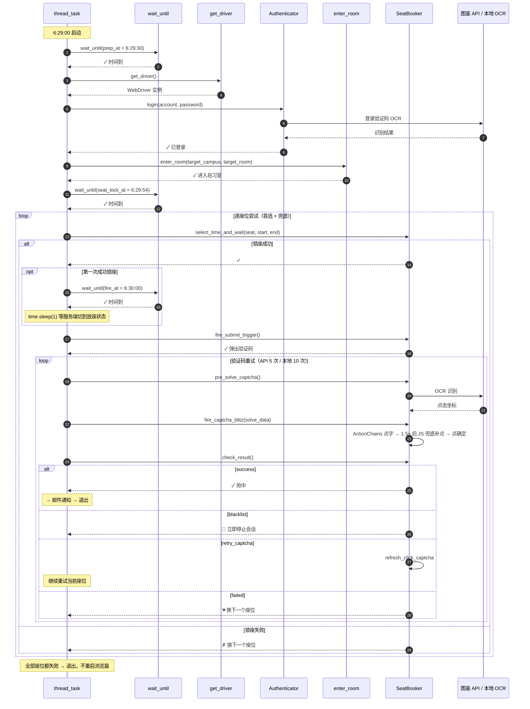
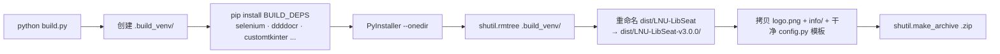

<div align="center">

# 🏗️ 架构与开发文档

### LNU-LibSeat v3.0.0 内部实现详解

[← 返回 README](../README.md) ·
[快速上手](QUICKSTART.md) ·
[配置详解](CONFIGURATION.md) ·
[v3.0.0 升级日志](RELEASE_NOTES.md)

</div>

---

## 📑 目录

- [整体架构](#整体架构)
- [模块依赖图](#模块依赖图)
- [核心抢座流程（时序图）](#核心抢座流程时序图)
- [各模块详解](#各模块详解)
- [关键设计决策](#关键设计决策)
- [PyInstaller 打包](#pyinstaller-打包)

---

## 整体架构

四层分层架构，**上层调用下层，下层不依赖上层**。



---

## 模块依赖图



> 📌 **依赖规则**：`logic/` 仅调用 `core/` 和 `config.py`；`main.py` 调用所有层；不允许反向依赖。

---

## 核心抢座流程（时序图）

下面是**定时模式**下，单账号 6:30 抢座的完整时序：



### 关键时间点

| 时刻 | 事件 | 提前量 |
|------|------|-------|
| `06:29:30` | 启动浏览器 + 登录 + 进自习室 | `PREP_LEAD_SECONDS = 30` |
| `06:29:54` | 开始锁定座位（点座位 + 选时间） | `SEAT_LOCK_LEAD_SECONDS = 6` |
| `06:30:00` | 触发「立即预约」按钮 | `fire_at` |
| `06:30:01` | 实际开始点击（1s 缓冲） | `time.sleep(1)` 让服务端切状态 |

---

## 各模块详解

### `main.py` — 入口与调度

| 函数 | 作用 |
|------|------|
| `build_strict_schedule()` | 计算严格 6:30 模式日程（10:00 后排到次日） |
| `build_custom_schedule()` | 自定义时刻模式日程（任意 hh:mm，过点排次日） |
| `wait_until()` | 分段精确等待，含 30 分钟心跳 + stop_event 响应 |
| `run_browser_session()` | 单次浏览器会话；创建会话文件夹 `logs/sessions/<ts>_<acct>/` |
| `run_timed_priority_attack()` | 全自习室扫描主循环（首选 + 兜底） |
| `thread_task()` | 单账号完整流程；处理维护期重试 |
| `main()` | 多线程入口（每个学号一个 thread） |

### `core/driver.py` — WebDriver 管理

三级回退：`config.DRIVER_PATH` → `webdriver-manager` → SeleniumManager。
支持 Edge / Chrome 双引擎。

### `core/captcha.py` — 本地验证码

| 类 | 用途 |
|----|------|
| `CaptchaSolver` | 登录验证码（4 位文本），全局单例 `solver` |
| `ClickCaptchaSolver` | 点选验证码（按提示点击文字），ddddocr 检测+分类双引擎，支持多字匹配 / 单字回退 / 易混字容错 |

### `core/captcha_api.py` — 图鉴 API

- **`TTShiTuClient`**：拼接「提示图 + 大图」竖向拼接后上传 → 解析返回坐标 → 映射回大图坐标系
- **单例懒加载** `get_client()`，凭据 base64 内嵌（仅在 6:30-6:35 或 `FORCE_API_ALWAYS=True` 时触发）

### `core/screen_recorder.py` — 浏览器录屏

`driver.get_screenshot_as_png()` 抓帧 → OpenCV 写 MP4。
为避免和主线程争 urllib3 连接，`main._enlarge_driver_pool()` 把池放大到 10。

### `logic/booker.py` — `SeatBooker` 核心类

| 方法 | 关键点 |
|------|-------|
| `select_time_and_wait()` | 选座 + 闪电失败检测 + 自动关闭遮挡弹窗；锁座 timeout 1s 实现 fail-fast |
| `pre_solve_captcha()` | 验证码预分析（API 优先、本地兜底） |
| `fire_captcha_blitz()` | ActionChains 点击文字 → 轮询按钮 60×0.05s → JS 兜底补点 → Selenium 点确认 |
| `check_result()` | `EC.any_of` 多结果检测：`success` / `blacklist` / `retry_captcha` / `failed` |
| `_save_screenshot()` | 截图命名：`优先级_座位_重试_阶段_时间戳.png` |
| `_build_solve_data()` | 像素坐标 → CSS 偏移量转换 |
| `_report_api_error_safe()` | 错识别上报图鉴 reporterror 退费 |

#### `check_result()` 状态枚举

```
success         → 邮件通知 → 退出
blacklist       → 🛑 立即停止本次会话（不再重试，避免加重处罚）
retry_captcha   → 验证码错误 / 系统繁忙 / 请稍后 → 刷新验证码继续
failed          → 已有预约 / 预约失败 → 关弹窗换下一座位
```

---

## 关键设计决策

| 决策 | 状态 | 理由 |
|------|-----|------|
| **单浏览器会话深度尝试** | ✅ | 每会话 N 座位 × 验证码重试，避免反复重启浏览器 |
| **全自习室兜底扫描** | ✅ | 首选耗尽 → 随机扫描剩余全部座位（v3.0.0 新增） |
| **图鉴 API 优先 + 本地兜底** | ✅ | 高峰期商业 API 拼准确率，平时本地拼速度 |
| **ActionChains + JS 双保险点击** | ✅ | Vue 异步渲染下 ActionChains 可能落空，1.5s 后 JS MouseEvent 用精确 CSS 坐标补点 |
| **`.el-button.confirm-btn` 选择器** | ✅ | 区分点击前的灰色 div 和点击后的真实按钮（Vue 条件渲染陷阱） |
| **会话级追溯目录** | ✅ | 独立文件夹 + 4 阶段截图 + session.log + 抢座顺序.txt + MP4 |
| **API 5 次 / 本地 10 次差异化重试** | ✅ | API 慢且贵，重试上限低；本地快且免费，重试上限高 |
| **`SEAT_LOCK_LEAD_SECONDS = 6`** | ✅ | v2.x 是 2，太短：实测锁座要 3-4s，余量不够会错过触发时机 |
| **`fire_at` 后 sleep(1s)** | ✅ | 避开服务端从「未放座」切到「已放座」的瞬态空档（v3.0.0 hotfix） |
| **黑名单立即停止** | ✅ | 命中「黑名单」提示立刻退出会话——继续重试只会加重处罚（v3.0.0 hotfix） |
| **`normalize-space()` 日期匹配** | ✅ | 修复 `5/4` 误匹配 `5/14` 的 XPath bug（v3.0.0 hotfix） |
| **`session.log` 仅含本次** | ✅ | 通过文件 offset 截取实现，避免历史日志灌水（v3.0.0 hotfix） |
| **`stop_event` 全链路** | ✅ | Ctrl+C / GUI 停止按钮即时响应，每个 sleep / loop 都监听 |
| **打包隔离 venv** | ✅ | `build.py` 创建临时 venv 仅装必需依赖，避免全局包被误打包 |
| **多自习室同时扫** | 🔬 | v3.x 构想中 |
| **失败模式智能学习** | 🔬 | v3.x 构想中 |

---

## PyInstaller 打包

```powershell
python build.py
```

### 隔离虚拟环境方案



### 输出

| 路径 | 说明 |
|------|------|
| `dist/LNU-LibSeat-v3.0.0/` | 完整可分发文件夹 |
| `dist/LNU-LibSeat-v3.0.0/LNU-LibSeat.exe` | 双击运行的 GUI 入口 |
| `dist/LNU-LibSeat-v3.0.0/config.py` | 干净模板（无个人数据） |
| `dist/LNU-LibSeat-v3.0.0/info/` | 双校区 20 间自习室座位索引 |
| `dist/LNU-LibSeat-v3.0.0/logs/` | 日志根目录（运行时填充） |
| `dist/LNU-LibSeat-v3.0.0.zip` | 上传 GitHub Release 用 |

### 关键 PyInstaller 参数

```python
# build.py 中
"--onedir",                      # 一个文件夹（非 onefile，启动快）
"--windowed",                    # GUI 模式无黑框
"--collect-all", "ddddocr",      # 把模型文件和原生库都打进去
"--collect-all", "onnxruntime",
"--collect-all", "selenium",
"--collect-all", "customtkinter",
"--exclude-module", "config",    # 不打 config.py — 用户外部覆盖
"--runtime-hook", "_runtime_hook.py",  # 启动时设 cwd 和 sys.path
```

---

## 🔗 相关文档

- 📘 [快速上手](QUICKSTART.md)
- ⚙️ [配置详解](CONFIGURATION.md)
- 📦 [v3.0.0 升级日志](RELEASE_NOTES.md)
- ☕ [README — 求赞助](../README.md#-求赞助--让免费持续)
