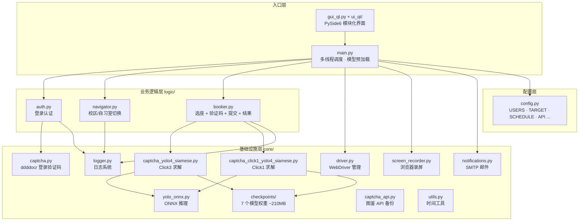
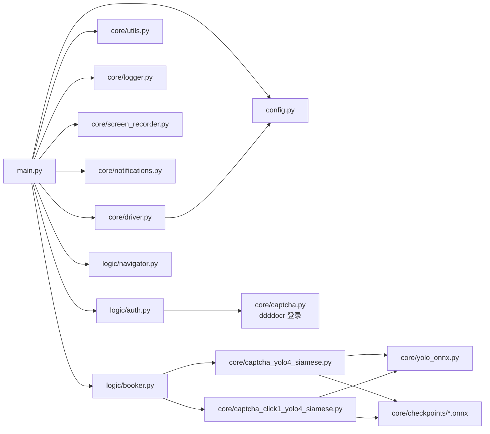
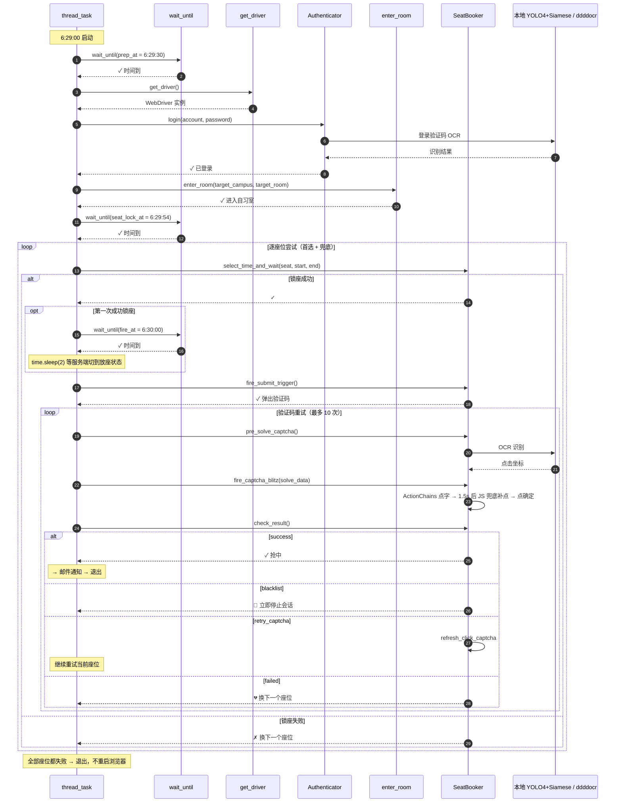
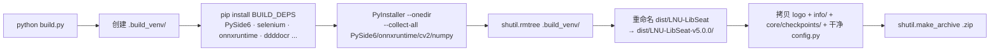

<div align="center">

# 🏗️ 架构与开发文档

### LNU-LibSeat v5.0.0 内部实现详解

[← 返回 README](../README.md) ·
[快速上手](QUICKSTART.md) ·
[配置详解](CONFIGURATION.md) ·
[v5.0.0 升级日志](RELEASE_NOTES_V5.md) ·
[v3→v5 升级指南](MIGRATION_V3_TO_V5.md)

</div>

---

## 📑 目录

- [v5.0.0 重大变化](#v500-重大变化)
- [整体架构](#整体架构)
- [模块依赖图](#模块依赖图)
- [核心抢座流程（时序图）](#核心抢座流程时序图)
- [各模块详解](#各模块详解)
- [关键设计决策](#关键设计决策)
- [PyInstaller 打包](#pyinstaller-打包)

---

## v5.0.0 重大变化

> 完整变更见 [RELEASE_NOTES_V5.md](RELEASE_NOTES_V5.md)。

| 重构 | 影响层 | 关键文件 |
|------|--------|---------|
| **PySide6 GUI 重构** | 入口层 | `gui_qt.py` + `ui_qt/` 23 模块（取代 `gui.py`） |
| **YOLO4+Siamese 本地验证码** | 基础设施层 | `core/captcha_yolo4_siamese.py` / `captcha_click1_yolo4_siamese.py` / `yolo_onnx.py` / `checkpoints/` |
| **模型预加载** | 入口层 | `main.py:_start_captcha_model_preload`（异步线程） |
| **线程安全锁** | 业务逻辑层 | `logic/booker.py:_CAPTCHA_SOLVER_LOCK` / `_YOLO4_SIAMESE_PRELOADED` |
| **配置精简** | 配置层 | 移除 `FORCE_API_ALWAYS`，新增 `MAX_ACCOUNTS=2` |
| **反馈分类细化** | 业务逻辑层 | `_classify_booking_result()` 新增 `"stop"` 类型 |

新增子文档：
- 🧠 [验证码引擎文档](CAPTCHA_YOLO4_SIAMESE.md) — YOLO4+Siamese 技术细节
- 🎨 [GUI 架构文档](GUI_QT_ARCHITECTURE.md) — PySide6 模块拆分

---

## 整体架构

四层分层架构，**上层调用下层，下层不依赖上层**。


```mermaid
graph TB
    subgraph 入口层
        GUI[gui_qt.py + ui_qt/<br/>PySide6 模块化界面]
        CLI[main.py<br/>多线程调度 · 模型预加载]
    end

    subgraph 业务逻辑层 logic/
        AUTH[auth.py<br/>登录认证]
        NAV[navigator.py<br/>校区/自习室切换]
        BOOK[booker.py<br/>选座 + 验证码 + 提交 + 结果]
    end

    subgraph 基础设施层 core/
        DRV[driver.py<br/>WebDriver 管理]
        CAP[captcha.py<br/>ddddocr 登录验证码]
        YOLO3[captcha_yolo4_siamese.py<br/>Click3 求解]
        YOLO1[captcha_click1_yolo4_siamese.py<br/>Click1 求解]
        ONNX[yolo_onnx.py<br/>ONNX 推理]
        CKPT[checkpoints/<br/>7 个模型权重 ~210MB]
        API[captcha_api.py<br/>图鉴 API 备份]
        REC[screen_recorder.py<br/>浏览器录屏]
        LOG[logger.py<br/>日志系统]
        NOTIF[notifications.py<br/>SMTP 邮件]
        UTIL[utils.py<br/>时间工具]
    end

    subgraph 配置层
        CFG[config.py<br/>USERS · TARGET · SCHEDULE · API ...]
    end

    GUI --> CLI
    CLI --> AUTH
    CLI --> NAV
    CLI --> BOOK
    CLI --> DRV
    CLI --> REC
    CLI --> NOTIF
    CLI --> CFG
    AUTH --> CAP
    BOOK --> YOLO3
    BOOK --> YOLO1
    YOLO3 --> ONNX
    YOLO1 --> ONNX
    YOLO3 --> CKPT
    YOLO1 --> CKPT
    AUTH --> LOG
    BOOK --> LOG
    NAV --> LOG
```

---

## 模块依赖图


```mermaid
flowchart LR
    main[main.py] --> cfg[config.py]
    main --> drv[core/driver.py]
    main --> util[core/utils.py]
    main --> log[core/logger.py]
    main --> rec[core/screen_recorder.py]
    main --> notif[core/notifications.py]
    main --> auth[logic/auth.py]
    main --> nav[logic/navigator.py]
    main --> book[logic/booker.py]

    drv --> cfg
    auth --> capsolver[core/captcha.py<br/>ddddocr 登录]
    book --> capy3[core/captcha_yolo4_siamese.py]
    book --> capy1[core/captcha_click1_yolo4_siamese.py]
    capy3 --> onnx[core/yolo_onnx.py]
    capy1 --> onnx
    capy3 --> ckpt[core/checkpoints/*.onnx]
    capy1 --> ckpt
```

> 📌 **依赖规则**：`logic/` 仅调用 `core/` 和 `config.py`；`main.py` 调用所有层；不允许反向依赖。

---

## 核心抢座流程（时序图）

下面是**定时模式**下，单账号 6:30 抢座的完整时序：


```mermaid
sequenceDiagram
    autonumber
    participant T as thread_task
    participant W as wait_until
    participant D as get_driver
    participant A as Authenticator
    participant N as enter_room
    participant B as SeatBooker
    participant API as 本地 YOLO4+Siamese / ddddocr

    Note over T: 6:29:00 启动
    T->>W: wait_until(prep_at = 6:29:30)
    W-->>T: ✓ 时间到

    T->>D: get_driver()
    D-->>T: WebDriver 实例
    T->>A: login(account, password)
    A->>API: 登录验证码 OCR
    API-->>A: 识别结果
    A-->>T: ✓ 已登录
    T->>N: enter_room(target_campus, target_room)
    N-->>T: ✓ 进入自习室

    T->>W: wait_until(seat_lock_at = 6:29:54)
    W-->>T: ✓ 时间到

    loop 逐座位尝试（首选 + 兜底）
        T->>B: select_time_and_wait(seat, start, end)
        alt 锁座成功
            B-->>T: ✓
            opt 第一次成功锁座
                T->>W: wait_until(fire_at = 6:30:00)
                W-->>T: ✓ 时间到
                Note over T: time.sleep(2) 等服务端切到放座状态
            end
            T->>B: fire_submit_trigger()
            B-->>T: ✓ 弹出验证码
            loop 验证码重试（最多 10 次）
                T->>B: pre_solve_captcha()
                B->>API: OCR 识别
                API-->>B: 点击坐标
                T->>B: fire_captcha_blitz(solve_data)
                B->>B: ActionChains 点字 → 1.5s 后 JS 兜底补点 → 点确定
                T->>B: check_result()
                alt success
                    B-->>T: ✓ 抢中
                    Note over T: → 邮件通知 → 退出
                else blacklist
                    B-->>T: 🛑 立即停止会话
                else retry_captcha
                    B->>B: refresh_click_captcha
                    Note over T: 继续重试当前座位
                else failed
                    B-->>T: 💔 换下一个座位
                end
            end
        else 锁座失败
            B-->>T: ✗ 换下一个座位
        end
    end

    Note over T: 全部座位都失败 → 退出，不重启浏览器
```

### 关键时间点

| 时刻 | 事件 | 提前量 |
|------|------|-------|
| `06:29:30` | 启动浏览器 + 登录 + 进自习室 | `PREP_LEAD_SECONDS = 30` |
| `06:29:54` | 开始锁定座位（点座位 + 选时间） | `SEAT_LOCK_LEAD_SECONDS = 6` |
| `06:30:00` | 触发「立即预约」按钮 | `fire_at` |
| `06:30:02` | 实际开始点击（2s 缓冲） | `time.sleep(2)` 让服务端切状态 |

---

## 各模块详解

### `main.py` — 入口与调度

| 函数 | 作用 |
|------|------|
| `build_custom_schedule()` | 自定义时刻模式日程（任意 hh:mm，过点排次日） |
| `wait_until()` | 分段精确等待，含 30 分钟心跳 + stop_event 响应 |
| `run_browser_session()` | 单次浏览器会话；创建会话文件夹 `logs/sessions/<ts>_<acct>/` |
| `run_timed_priority_attack()` | 全自习室扫描主循环（首选 + 兜底） |
| `thread_task()` | 单账号完整流程；处理维护期重试 |
| `main()` | 多线程入口（每个学号一个 thread） |

### `core/driver.py` — WebDriver 管理

三级回退：`config.DRIVER_PATH` → `webdriver-manager` → SeleniumManager。
支持 Edge / Chrome 双引擎。

### `core/captcha.py` — 登录验证码（ddddocr）

| 类 | 用途 |
|----|------|
| `CaptchaSolver` | 登录页 4 位文本验证码，全局单例 `solver`（v5 中 `ClickCaptchaSolver` 已删除） |

### `core/captcha_yolo4_siamese.py` — Click3（3 点连击）求解（v5 新增）

- **`Yolo4SiameseSolver.solve(target_bytes, bg_bytes)`** → `Yolo4SiameseResult`
- YOLO4 检测背景图字符位置（输入 640×640，置信度 ≥ 0.05），输出 4 个候选框
- Siamese 网络（112×112 输入）按相似度排序 → 输出 3 个点击坐标 + 匹配度
- 模型：`checkpoints/click3_yolo_plan_bg_char60_best.onnx` + `click3_siamese_yolo4_posw3_best.onnx`

### `core/captcha_click1_yolo4_siamese.py` — Click1（单字定位）求解（v5 新增）

- **`Click1Yolo4SiameseSolver.solve(target_bytes, bg_bytes)`** → `Click1SiameseResult`
- 同 Click3 管线，但只输出 1 个最相似的点击坐标
- 端到端准确率 **83.48%**
- 模型：`checkpoints/click1_yolo_plan_bg_char40_best.onnx` + `click1_siamese_yolo4_best.onnx`

### `core/yolo_onnx.py` — YOLO4 ONNX 推理引擎（v5 新增）

- 通用 ONNX runtime 封装：letterbox 预处理 + NMS 后处理（最多 300 检测）
- 默认参数：置信度 0.05，IoU 0.45，输入 640，填充色 114
- 完全无 PyTorch 依赖，仅 `onnxruntime` + `numpy` + `opencv-python`

### `core/checkpoints/` — 模型权重（v5 新增，~210MB）

| 文件 | 类型 | 用途 |
|------|------|------|
| `click3_yolo_plan_bg_char60_best.onnx` | ONNX 推理 | Click3 YOLO 检测 |
| `click3_yolo_plan_bg_char60_best.pt` | PyTorch 源 | Click3 YOLO 训练权重 |
| `click3_siamese_yolo4_posw3_best.onnx` | ONNX 推理 | Click3 Siamese 相似度 |
| `click3_siamese_yolo4_posw3_best.pth` | PyTorch 源 | Click3 Siamese 训练权重 |
| `click1_yolo_plan_bg_char40_best.onnx` | ONNX 推理 | Click1 YOLO 检测 |
| `click1_yolo_plan_bg_char40_best.pt` | PyTorch 源 | Click1 YOLO 训练权重 |
| `click1_siamese_yolo4_best.onnx` | ONNX 推理 | Click1 Siamese 相似度 |

详细技术细节见 [CAPTCHA_YOLO4_SIAMESE.md](CAPTCHA_YOLO4_SIAMESE.md)。

### `core/captcha_api.py` — 图鉴 API（v5 保留备份，默认不调用）

- **`TTShiTuClient`** 仍存在于代码中，但 v5 主流程已不调用
- 如需自行重启 API 链路，参考 v3.0.0 调用方式
- 详见 [MIGRATION_V3_TO_V5.md §FAQ](MIGRATION_V3_TO_V5.md#-faq)

### `gui_qt.py` + `ui_qt/` — PySide6 GUI（v5 新增）

`gui_qt.py` 仅 8 行，委托 `ui_qt.app:main()`。`ui_qt/` 23 模块拆分：

| 子目录 | 文件数 | 职责 |
|--------|--------|------|
| `ui_qt/` 根 | 2 | `app.py`(MainWindow) + `theme.py`(全局主题) |
| `panels/` | 2 | 左侧 ConfigPanel + 右侧 DashboardPanel |
| `widgets/` | 11 | 倒计时环 / 日志终端 / 账号卡 / 按钮 / Logo 等 |
| `workers/` | 1 | `booker_worker.py` 后台抢座线程 |
| `services/` | 2 | `config_io.py` + `prevent_sleep.py` |

完整拆分见 [GUI_QT_ARCHITECTURE.md](GUI_QT_ARCHITECTURE.md)。

### `core/screen_recorder.py` — 浏览器录屏

`driver.get_screenshot_as_png()` 抓帧 → OpenCV 写 MP4。
为避免和主线程争 urllib3 连接，`main._enlarge_driver_pool()` 把池放大到 10。

### `logic/booker.py` — `SeatBooker` 核心类

| 方法 | 关键点 |
|------|-------|
| `select_time_and_wait()` | 选座 + 闪电失败检测 + 自动关闭遮挡弹窗；锁座 timeout 1s 实现 fail-fast |
| `pre_solve_captcha()` | 验证码预分析（API 优先、本地兜底） |
| `fire_captcha_blitz()` | ActionChains 点击文字 → 轮询按钮 60×0.05s → JS 兜底补点 → Selenium 点确认 |
| `check_result()` | `EC.any_of` 多结果检测：`success` / `stop` / `blacklist` / `retry_captcha` / `failed` |
| `_save_screenshot()` | 截图命名：`优先级_座位_重试_阶段_时间戳.png` |
| `_build_solve_data()` | 像素坐标 → CSS 偏移量转换 |
| `_report_api_error_safe()` | 错识别上报图鉴 reporterror 退费 |

#### `check_result()` 状态枚举

```
success         → 邮件通知 → 退出
stop            → 🛑 系统限制 / 每日上限 / 部分读者开放 → 立即停止会话
blacklist       → 🛑 立即停止本次会话（不再重试，避免加重处罚）
retry_captcha   → 验证码错误 / 系统繁忙 / 请稍后 → 刷新验证码继续
failed          → 已有预约 / 预约失败 → 关弹窗换下一座位
```

---

## 关键设计决策

| 决策 | 状态 | 理由 |
|------|-----|------|
| **单浏览器会话深度尝试** | ✅ | 每会话 N 座位 × 验证码重试，避免反复重启浏览器 |
| **全自习室兜底扫描** | ✅ | 首选耗尽 → 随机扫描剩余全部座位（v3.0.0 新增） |
| **本地 YOLO4+Siamese 优先** | ✅ v5 | 06:30-06:35 窗口内本地推理，窗口外关闭验证码弹窗换座 |
| **ActionChains + JS 双保险点击** | ✅ | Vue 异步渲染下 ActionChains 可能落空，1.5s 后 JS MouseEvent 用精确 CSS 坐标补点 |
| **`.el-button.confirm-btn` 选择器** | ✅ | 区分点击前的灰色 div 和点击后的真实按钮（Vue 条件渲染陷阱） |
| **会话级追溯目录** | ✅ | 独立文件夹 + 4 阶段截图 + session.log + 抢座顺序.txt + MP4 |
| **本地模型 10 次重试** | ✅ v5 | 本地 YOLO4+Siamese 快且免费，每个座位最多 10 次验证码机会 |
| **`SEAT_LOCK_LEAD_SECONDS = 6`** | ✅ | v2.x 是 2，太短：实测锁座要 3-4s，余量不够会错过触发时机 |
| **`fire_at` 后 sleep(2s)** | ✅ | 避开服务端从「未放座」切到「已放座」的瞬态空档（v3.0.0 hotfix） |
| **黑名单立即停止** | ✅ | 命中「黑名单」提示立刻退出会话——继续重试只会加重处罚（v3.0.0 hotfix） |
| **`normalize-space()` 日期匹配** | ✅ | 修复 `5/4` 误匹配 `5/14` 的 XPath bug（v3.0.0 hotfix） |
| **`session.log` 仅含本次** | ✅ | 通过文件 offset 截取实现，避免历史日志灌水（v3.0.0 hotfix） |
| **`stop_event` 全链路** | ✅ | Ctrl+C / GUI 停止按钮即时响应，每个 sleep / loop 都监听 |
| **打包隔离 venv** | ✅ | `build.py` 创建临时 venv 仅装必需依赖，避免全局包被误打包 |
| **自研 YOLO4+Siamese 替代图鉴 API** | ✅ v5 | 商业 API 0.016 元/次烧不起，本地推理离线零成本（[CAPTCHA_YOLO4_SIAMESE.md](CAPTCHA_YOLO4_SIAMESE.md)） |
| **06:30-06:35 时间窗口** | ✅ v5 | 本地模型仅在抢座窗口启用，其他时段不消耗 CPU |
| **模型预加载异步线程** | ✅ v5 | `main.py:31-51`，避免抢座当下冷启动 3-5s 延迟 |
| **PySide6 替代 CustomTkinter** | ✅ v5 | Qt 原生渲染解决高分屏不一致，模块化拆分易维护 |
| **`MAX_ACCOUNTS = 2` 并发上限** | ✅ v5 | 超过自动截断；多账号通过 `slot_index × 8s` 偏移避免争抢 |
| **线程安全锁** | ✅ v5 | `_CAPTCHA_SOLVER_LOCK` + `_YOLO4_SIAMESE_PRELOADED` 防多账号并发推理冲突 |
| **多自习室同时扫** | 🔬 | 后续规划 |
| **失败模式智能学习** | 🔬 | 后续规划 |

---

## PyInstaller 打包

```powershell
python build.py
```

### 隔离虚拟环境方案


```mermaid
flowchart LR
    A[python build.py] --> B[创建 .build_venv/]
    B --> C[pip install BUILD_DEPS<br/>PySide6 · selenium · onnxruntime · ddddocr ...]
    C --> D[PyInstaller --onedir<br/>--collect-all PySide6/onnxruntime/cv2/numpy]
    D --> E[shutil.rmtree .build_venv/]
    E --> F[重命名 dist/LNU-LibSeat<br/>→ dist/LNU-LibSeat-v5.0.0/]
    F --> G[拷贝 logo + info/ + core/checkpoints/ + 干净 config.py]
    G --> H[shutil.make_archive .zip]
```

### 输出

| 路径 | 说明 |
|------|------|
| `dist/LNU-LibSeat-v5.0.0/` | 完整可分发文件夹 |
| `dist/LNU-LibSeat-v5.0.0/LNU-LibSeat.exe` | 双击运行的 GUI 入口 |
| `dist/LNU-LibSeat-v5.0.0/config.py` | 干净模板（无个人数据） |
| `dist/LNU-LibSeat-v5.0.0/info/` | 双校区 21 间自习室座位索引（含新「智慧空间」） |
| `dist/LNU-LibSeat-v5.0.0/_internal/core/checkpoints/` | YOLO4+Siamese 模型权重 (~210MB) |
| `dist/LNU-LibSeat-v5.0.0/logs/` | 日志根目录（运行时填充） |
| `dist/LNU-LibSeat-v5.0.0.zip` | 上传 GitHub Release 用 |

> ⚠️ `build.py:28` 中 `APP_VERSION = "v5.0.0"`，表示当前的主版本号。

### 关键 PyInstaller 参数

```python
# build.py 中
"--onedir",                      # 一个文件夹（非 onefile，启动快）
"--windowed",                    # GUI 模式无黑框
"--collect-all", "ddddocr",      # 把模型文件和原生库都打进去
"--collect-all", "onnxruntime",
"--collect-all", "selenium",
"--collect-all", "PySide6",
"--exclude-module", "config",    # 不打 config.py — 用户外部覆盖
"--runtime-hook", "_runtime_hook.py",  # 启动时设 cwd 和 sys.path
```

---

## 🔗 相关文档

- 📘 [快速上手](QUICKSTART.md)
- 🚀 [v3→v5 升级指南](MIGRATION_V3_TO_V5.md) — 老用户必读
- ⚙️ [配置详解](CONFIGURATION.md)
- 🧠 [验证码引擎文档](CAPTCHA_YOLO4_SIAMESE.md) — YOLO4+Siamese 技术细节
- 🎨 [GUI 架构文档](GUI_QT_ARCHITECTURE.md) — PySide6 模块拆分
- 📋 [反馈消息处理参考](FEEDBACK_MESSAGES.md)
- 🔢 [数字参数](NUMERIC_PARAMETERS.md) — 所有超时/延迟/阈值清单
- 🔀 [抢座流程图](BOOKING_FLOWCHART.md) — 11 张 Mermaid 流程图
- 📦 [v5.0.0 升级日志](RELEASE_NOTES_V5.md)
- 📜 [v3.0.0 历史日志](RELEASE_NOTES.md)
- ☕ [README — 求赞助](../README.md#-求赞助--支持持续开发)
