# 抢座完整流程图

本文按当前代码实现绘制，覆盖单账号从启动到结束的主要路径、异常分支、重试分支和停止条件。

术语说明：

- `停止`：当前账号任务结束，通常不再尝试其他座位。
- `重启结果`：`run_browser_session()` 返回 `restart`。当前 `thread_task()` 对普通 `restart` 不做循环重启，只记录结果并结束；只有系统维护分支会按规则再次启动浏览器。
- `换座`：关闭当前弹窗后进入下一个候选座位。
- `重试当前座位`：刷新验证码或重新锁定同一个座位后继续当前座位。
- `真实黑名单处罚文本`：必须匹配“对不起，您已被加入黑名单，预约权限将在{任意日期}恢复。原因：7天内迟到违约，超过3次，加入黑名单7天”。其中日期可变，其它信息按固定结构判断。

## 1. 总控流程

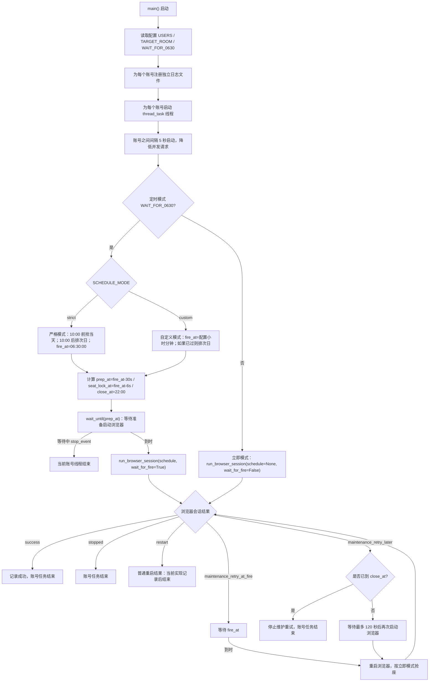

## 2. 浏览器会话流程

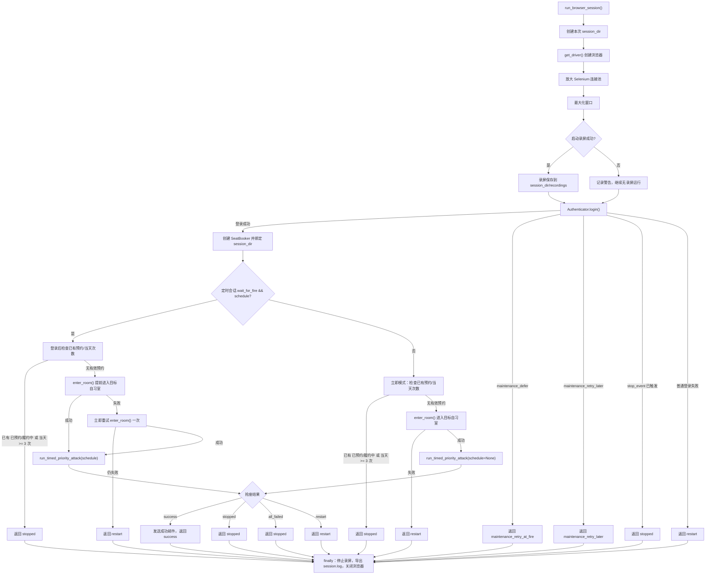

## 3. 登录流程

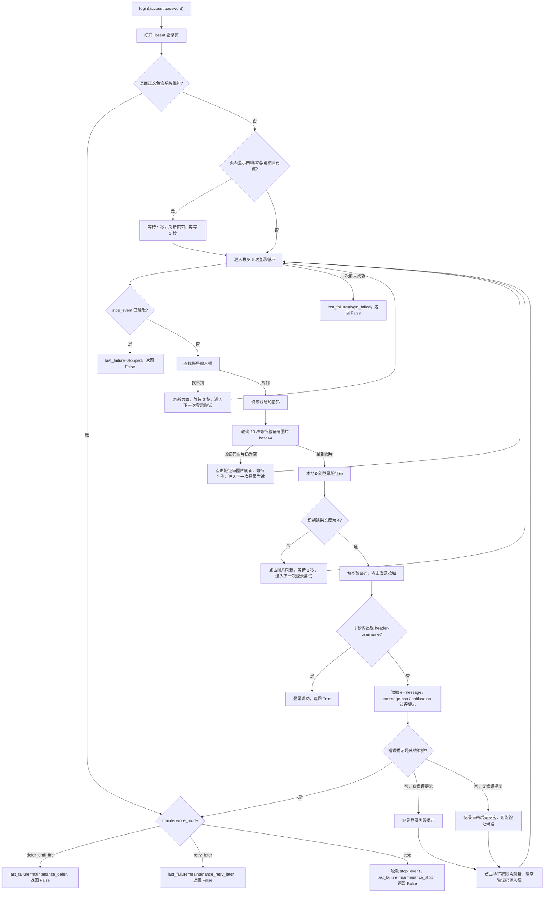

## 4. 已有预约与当天次数检查

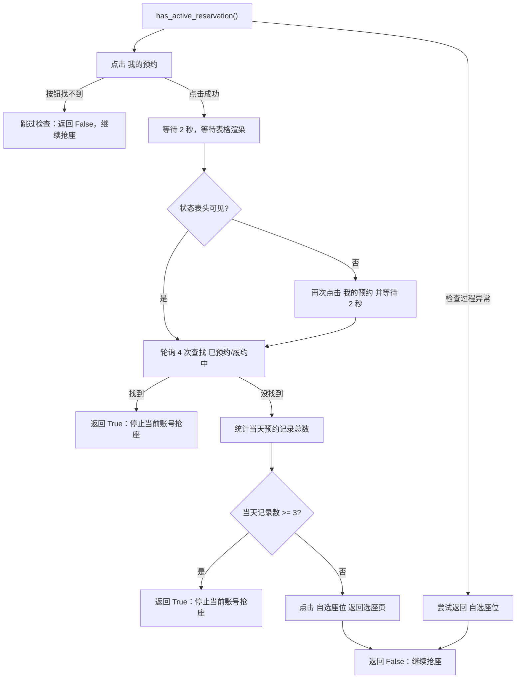

## 5. 进房流程

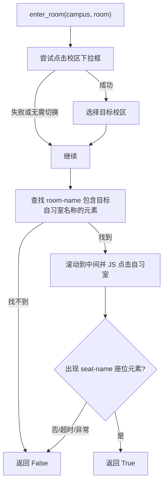

## 6. 座位候选列表与座位循环

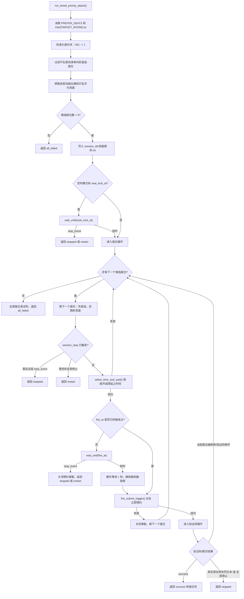

## 7. 单个座位锁定与时间选择

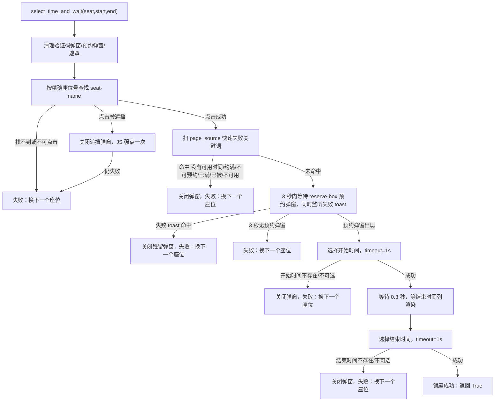

## 8. 验证码与提交分支

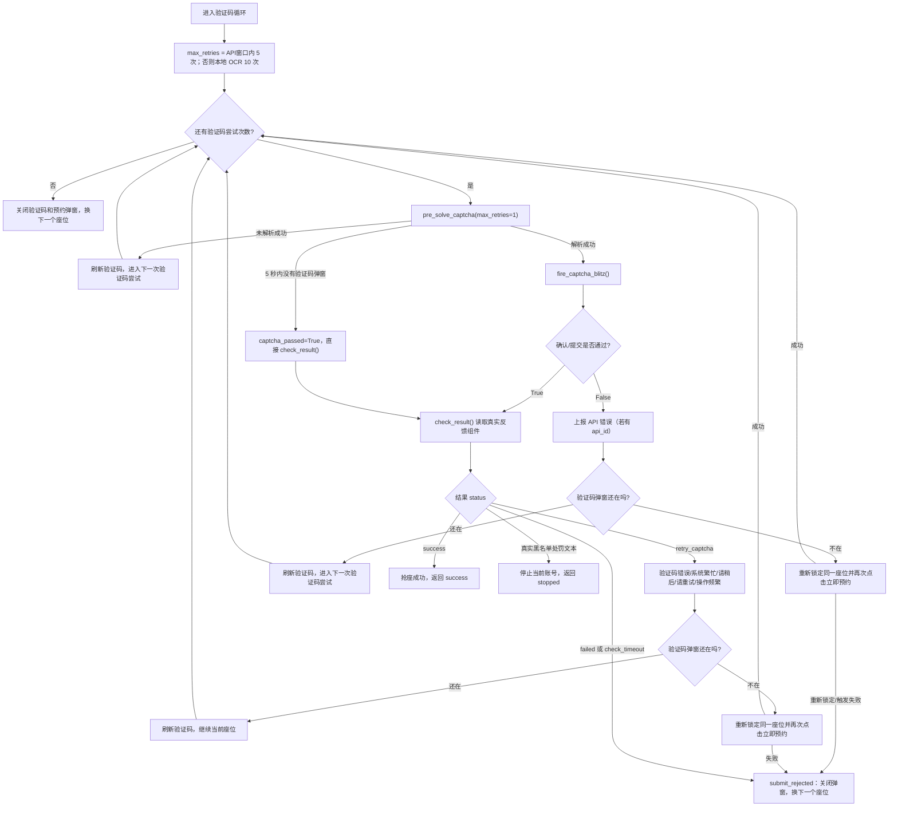

## 9. 验证码内部细节

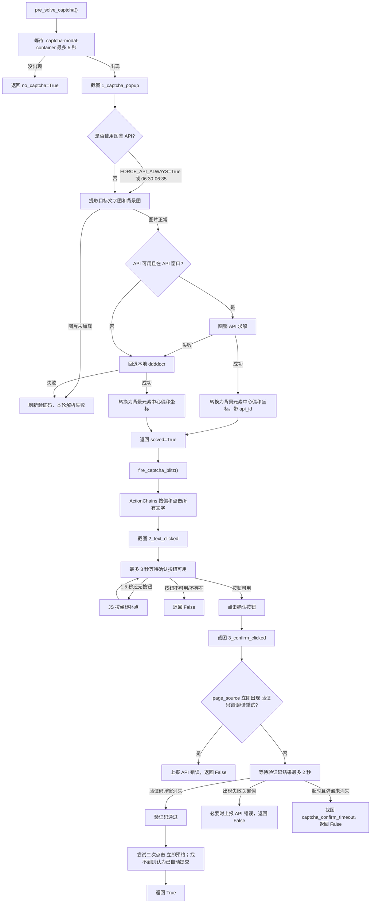

## 10. 预约结果分类

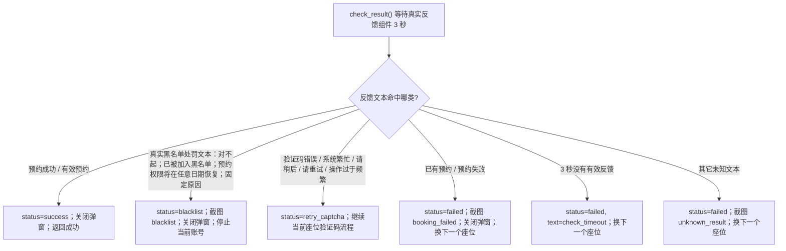

结果状态汇总：

| 出现位置 | 触发条件 | 下一步 |
| --- | --- | --- |
| 登录前检查 | 页面含系统维护 | 按 maintenance_mode：等 fire_at、稍后重试、或停止所有任务 |
| 登录循环 | 5 次登录都失败 | 返回 `restart`，当前账号任务结束 |
| 已有预约检查 | 有 `已预约` 或 `履约中` | 当前账号停止 |
| 当天次数检查 | 当天预约记录数 `>= 3` | 当前账号停止 |
| 进房 | 两次进入目标自习室失败 | 返回 `restart`，当前账号任务结束 |
| 锁座 | 座位不存在、不可点击、时间不可选、无预约框、已满等 | 换下一个座位 |
| 点击立即预约 | 找不到/点不了提交按钮 | 换下一个座位 |
| 验证码解析 | 图片未加载、API/OCR 解析失败 | 刷新验证码，继续当前座位 |
| 验证码确认 | 验证码错误/请重试 | 上报 API 错误，刷新或重锁当前座位 |
| 预约结果 | `success` | 发送成功邮件，任务结束 |
| 预约结果 | `blacklist`，且文本匹配“对不起，您已被加入黑名单，预约权限将在{任意日期}恢复。原因：7天内迟到违约，超过3次，加入黑名单7天” | 当前账号立刻停止 |
| 预约结果 | 只含规则说明，例如“连续或7天内累计3次违约，将被列入黑名单7天” | 不按黑名单停止；按其它结果继续分类 |
| 预约结果 | 只含不完整黑名单字样，例如“账号已被加入黑名单，暂不能预约” | 不按黑名单停止；按其它结果继续分类 |
| 预约结果 | `retry_captcha` | 刷新验证码或重锁当前座位 |
| 预约结果 | `failed` / `check_timeout` | 换下一个座位 |
| 座位循环 | 所有首选和兜底座位都失败 | 当前账号停止 |

## 11. 文件和截图产物

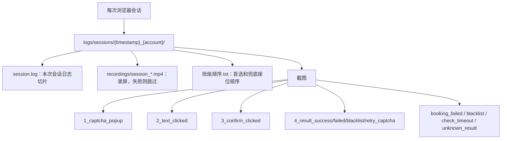
