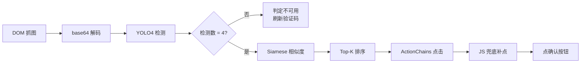

<div align="center">

# 🧠 验证码引擎：YOLO4 + Siamese

### LNU-LibSeat v5.0.0 自研本地识别管线

[← 返回 README](../README.md) ·
[架构文档](ARCHITECTURE.md) ·
[v5.0.0 升级日志](RELEASE_NOTES_V5.md) ·
[数字参数](NUMERIC_PARAMETERS.md)

</div>

> [!NOTE]
> 本文标题与文件名中的 **YOLO4** 仅为项目内部实验代号，**不代表检测器架构版本**。实际检测器是
> [ultralytics **YOLOv8**](https://github.com/ultralytics/ultralytics)；历史命名（`yolo4` 模块名 /
> ONNX 权重名 / 本文标题与小节锚点）沿用至今仅为兼容，不强制改名。

---

## 📑 目录

- [验证码类型](#-验证码类型)
- [整体管线](#-整体管线)
- [YOLO4 检测层](#-yolo4-检测层)
- [Siamese 相似度层](#-siamese-相似度层)
- [时间窗口机制](#-时间窗口机制)
- [模型预加载](#-模型预加载)
- [线程安全](#-线程安全)
- [准确率与延迟](#-准确率与延迟)
- [与 v3 引擎对比](#-与-v3-引擎对比)
- [自训练流程](#-自训练流程)
- [故障排查](#-故障排查)

---

## 🎯 验证码类型

辽大图书馆预约系统使用两类点选验证码：

| 类型 | 名称 | 提示 | 输出 |
|------|------|------|------|
| **Click1** | 单字定位 | 「请点击图中的'X'」 | 1 个点击坐标 |
| **Click3** | 3 点连击 | 「请按顺序点击图中：'X' '_' '_'」 | 3 个点击坐标（有顺序） |

两类都由 YOLO4+Siamese 双阶段管线处理，**模型独立，结构相同**。

---

## 🔄 整体管线



### 关键代码位置

| 阶段 | 文件 | 函数 |
|------|------|------|
| 抓图 | `logic/booker.py` | `_read_captcha_images()` |
| 解码 + 检测 | `core/yolo_onnx.py` | `YoloOnnxPredictor.predict()` |
| Click3 求解 | `core/captcha_yolo4_siamese.py` | `Yolo4SiameseSolver.solve()` |
| Click1 求解 | `core/captcha_click1_yolo4_siamese.py` | `Click1Yolo4SiameseSolver.solve()` |
| 点击执行 | `logic/booker.py` | `fire_captcha_blitz()` |

---

## 🔍 YOLO4 检测层

> 源码：`core/yolo_onnx.py` + ONNX 模型

### 模型路径

| 验证码 | ONNX 文件 | 输入尺寸 | 训练源 |
|--------|-----------|----------|--------|
| Click1 | `core/checkpoints/click1_yolo_plan_bg_char40_best.onnx` | 640×640 | `*.pt` |
| Click3 | `core/checkpoints/click3_yolo_plan_bg_char60_best.onnx` | 640×640 | `*.pt` |

### 推理参数

| 参数 | Click1 | Click3 | 位置 | 说明 |
|------|--------|--------|------|------|
| 输入尺寸 | 640 px | 640 px | `captcha_click1*:98` / `captcha_yolo4*:105` | YOLO 标准 |
| 置信度阈值 | 0.05 | 0.05 | :99 / :106 | 低于则过滤 |
| IoU 阈值 | 0.7 | 0.45 | :100 / :107 | NMS 去重 |
| `top_k` | 4 | 4 | :103 / :110 | 保留最大候选数 |
| 字符裁剪尺寸 | 60 px | 60 px | :104 / :111 | Siamese 输入裁剪边长 |
| letterbox 填充 | 114 | 114 | `yolo_onnx.py:83` | YOLO 标准深灰 |
| 最大检测数 | 300 | 300 | `yolo_onnx.py:44` | NMS 后保留上限 |

### "恰好 4 个检测"硬门槛

```python
# core/captcha_click1_yolo4_siamese.py:239
if len(boxes) != 4:
    return Click1SiameseResult(solved=False, ...)
```

如果 YOLO 检测数 ≠ 4 → 直接判定验证码不可用，刷新重试。

这是为了避免：检测到 3 个时漏点 / 检测到 5+ 个时点错。

> [!NOTE]
> 这条规则会损失一定的准确率（实测损失约 15%），但保证**只要解了就高度正确**。

---

## 🧬 Siamese 相似度层

### 模型路径

| 验证码 | ONNX 文件 | 输入尺寸 | 训练源 |
|--------|-----------|----------|--------|
| Click1 | `core/checkpoints/click1_siamese_yolo4_best.onnx` | 112×112 | `*.pth`（无） |
| Click3 | `core/checkpoints/click3_siamese_yolo4_posw3_best.onnx` | 112×112 | `*.pth` |

### 工作流程

```
target 图（提示字符 4 个 / 1 个）
    ↓ 各 crop 到 112×112
candidate 框（YOLO 检测到的 4 个背景候选）
    ↓ 各 crop 到 112×112
   ↓
Siamese 网络（孪生子网共享权重）
    ↓ 输出 4×4 / 1×4 的相似度矩阵
匈牙利匹配 / argmax
    ↓
最终点击坐标
```

### 网络结构（训练时）

| 层 | 配置 | 位置 |
|----|------|------|
| Backbone | MobileNetV4-Conv-Medium | `model/siamese_model.py:27` |
| 特征维度 | 1280 | `model/siamese_model.py:27` |
| Dropout | 0.2 | `model/siamese_model.py:28` |
| 融合头 | Linear: 5120→512→128→1 | `model/siamese_model.py:31-36` |

### Click3 的额外约束

```python
# core/captcha_yolo4_siamese.py:278
if matched_count < 3:
    return Yolo4SiameseResult(solved=False, ...)
```

3 点必须**全部**匹配到候选，否则判失败。

---

## ⏰ 时间窗口机制

> v5.0.0 关键设计决策。源码：`logic/booker.py:LOCAL_CAPTCHA_WINDOW_START/END`

### 设定

```python
# logic/booker.py:38-39
LOCAL_CAPTCHA_WINDOW_START = dt_time(6, 30, 0)   # 06:30:00
LOCAL_CAPTCHA_WINDOW_END   = dt_time(6, 35, 0)   # 06:35:00
```

### 行为

| 当前时间 | 行为 |
|---------|------|
| 06:30:00 – 06:35:00 | ✅ 加载模型 + 解析验证码 |
| 其他时段 | ❌ `pre_solve_captcha()` 返回 `{"outside_model_window": True, "solved": False}` → 主循环立即换座 |

### 为什么这么设计

1. **CPU 节约**：YOLO + Siamese 推理 ~500ms，占满 1 个 CPU 核心；非抢座时段没必要
2. **冷启动隔离**：保证抢座当下推理在已预热状态
3. **避免无意义识别**：非高峰时段验证码失败的真实原因往往是「座位已被预约」，识别正确也没用

### 错峰抢座怎么办？

如果你抢的是非 06:30 时段（如错峰 14:00 放座），需要修改窗口：

```python
# logic/booker.py
LOCAL_CAPTCHA_WINDOW_START = dt_time(14, 0, 0)
LOCAL_CAPTCHA_WINDOW_END   = dt_time(14, 5, 0)
```

> [!WARNING]
> 这是源码修改，exe 用户无法直接改。建议直接拉源码重新打包。

---

## 🧊 模型预加载

> 源码：`main.py:31-51` `_start_captcha_model_preload`

### 工作原理

```python
def _start_captcha_model_preload(reason: str = "scheduled") -> None:
    """Start one background warmup for YOLO4+Siamese."""
    global _CAPTCHA_PRELOAD_THREAD
    if _CAPTCHA_PRELOAD_THREAD is not None and _CAPTCHA_PRELOAD_THREAD.is_alive():
        return  # 已在跑，不重复启动

    def _worker():
        from logic.booker import preload_yolo4_siamese_model
        preload_yolo4_siamese_model("preload")

    _CAPTCHA_PRELOAD_THREAD = threading.Thread(
        target=_worker, name="captcha-yolo4-siamese-preload", daemon=True,
    )
    _CAPTCHA_PRELOAD_THREAD.start()
```

### 触发时机

| 入口 | 时机 |
|------|------|
| `main.py:main()` 定时模式 | 启动时立即触发（`_start_captcha_model_preload("scheduled startup")`） |
| `main.py:main()` 立即模式 | 同上（`_start_captcha_model_preload("immediate startup")`） |
| GUI 启动 | 通过 `BookerWorker` 间接触发 |

### 收益

- 模型加载（ONNX 解析 + opcache 编译）耗时约 **3-5s**
- 不预加载 → 06:30 当下解第一个验证码会卡顿 → 错过提交窗口
- 预加载后 → 06:30 解第一个验证码 < 1s

---

## 🔒 线程安全

> 源码：`logic/booker.py` 模块级全局

### 全局状态

```python
# logic/booker.py
_CAPTCHA_SOLVER_LOCK = threading.Lock()       # 模型加载锁
_YOLO4_SIAMESE_PRELOADED = False              # 一次性标志
```

### 使用模式

```python
def preload_yolo4_siamese_model(reason: str = "manual"):
    global _YOLO4_SIAMESE_PRELOADED
    with _CAPTCHA_SOLVER_LOCK:
        if _YOLO4_SIAMESE_PRELOADED:
            return  # 已加载过，直接返回
        # ... 加载 ONNX 模型 ...
        _YOLO4_SIAMESE_PRELOADED = True
```

### 多账号场景

| 场景 | 行为 |
|------|------|
| 账号 A 先到 06:29:30 触发解析 | 拿到锁，加载模型，标志置 True |
| 账号 B 紧随 06:29:38（slot+8s）触发 | 拿到锁后发现标志已 True，直接返回 |
| 同时触发（极端） | 串行加载，第二个等第一个完成 |

---

## 📊 准确率与延迟

| 验证码 | 单次准确率 | 推理延迟（CPU） | 说明 |
|--------|-----------|----------------|------|
| **Click1** | **83.48%** | < 1s（预计） | 端到端实测数据来自测试集 |
| **Click3** | 待回测 | < 1s（预计） | 需 3 点全对，难度更高 |

> 完整性能数据见 [V5_PERFORMANCE.md](V5_PERFORMANCE.md)。

### 实测局限性（来自 v5.0.0 开发阶段测试）

| 因素 | 说明 |
|------|------|
| 「恰好 4 检测」硬门槛 | 损失约 15% 召回 |
| Siamese 无置信度阈值 | argmax 硬选，低分场景误差大 |
| 目标字符裁剪坐标硬编码 | 字号偏差敏感 |
| YOLO bbox 偏移直接传导 | 检测框偏移 → 点击位置偏移 |

详细分析见历史 [TEST_SUMMARY.md](TEST_SUMMARY.md)。

---

## 🔬 与 v3 引擎对比

| 维度 | v3 图鉴 API | v3 ddddocr | **v5 YOLO4+Siamese** |
|------|-------------|------------|----------------------|
| **类型** | 商业云端 API | 通用 OCR | 自研专用 |
| **联网** | ✅ 强依赖 | ❌ 离线 | ❌ 离线 |
| **延迟（平均）** | 7.21s | 0.51s | < 1s |
| **延迟（范围）** | 3.5–17.8s | 0.32–0.65s | 待回测 |
| **单次准确率** | 100% | 61.2% | Click1 83.48% |
| **累计 5 次通过** | 100% | 100% | 待回测 |
| **成本/次** | 0.016 元 | 0 | 0 |
| **资源消耗** | 网络流量 | 极低 CPU | 中等 CPU（推理） |
| **维护负担** | 商家维护 | 第三方维护 | 自维护（可重训） |

**结论**：v5 用一次性 210MB 模型体积换取了**离线 + 零成本 + 可定制**。

---

## 🧪 自训练流程

> 适合：想用自己的数据集训练新模型替换默认权重。

### 必备文件（仓库自带）

- `model/siamese_dataloader.py` — 数据加载 + 数据增强
- `model/siamese_model.py` — Siamese 网络定义

### 训练参数（默认）

| 参数 | 值 | 位置 |
|------|---|------|
| 特征维度 | 1280 | `model/siamese_model.py:27` |
| Dropout | 0.2 | `model/siamese_model.py:28` |
| 融合层 | 5120→512→128→1 | `model/siamese_model.py:31-36` |
| 输入尺寸 | 112×112 | `model/siamese_dataloader.py:177` |
| 训练/验证比 | 0.8 | `model/siamese_dataloader.py:70` |
| 随机种子 | 42 | `model/siamese_dataloader.py:110` |
| 数据增强：旋转 | ±15° | `model/siamese_dataloader.py:217` |
| 数据增强：HSV 色相 | ±18 | `model/siamese_dataloader.py:225` |
| 数据增强：HSV 饱和度 | 0.3-1.7 | `model/siamese_dataloader.py:226` |
| 数据增强：HSV 明度 | 0.7-1.3 | `model/siamese_dataloader.py:227` |

### 导出 ONNX

训练完成后用 PyTorch 自带的 `torch.onnx.export()` 导出，覆盖到 `core/checkpoints/click1_siamese_yolo4_best.onnx`（或对应路径）即可。

详见 PyTorch 官方文档：https://pytorch.org/docs/stable/onnx.html

---

## 🛠️ 故障排查

<details>
<summary><b>Q1: 启动后日志报「模型加载失败」？</b></summary>

检查：
- `core/checkpoints/` 目录是否存在
- 4 个 ONNX 文件是否齐全
- ONNX 文件大小是否正常（每个约 20-80MB）

如果 exe 用户碰到：尝试解压一份新的 v5 zip 替换 `_internal/core/checkpoints/`。
</details>

<details>
<summary><b>Q2: 06:30 前的测试中验证码不识别？</b></summary>

这是设计如此。本地模型仅在 06:30:00–06:35:00 启用，其他时段直接换座。

如果你想测试，临时修改 `logic/booker.py:LOCAL_CAPTCHA_WINDOW_START/END` 为当前时间附近的窗口。
</details>

<details>
<summary><b>Q3: ONNX runtime 报错 / 提示缺失？</b></summary>

```powershell
pip install --force-reinstall onnxruntime>=1.17.0
```

或在源码方式下：

```powershell
pip install -r requirements.txt
```
</details>

<details>
<summary><b>Q4: 推理太慢（> 3s）？</b></summary>

- 关闭其他 CPU 密集进程（浏览器开了 20 个 tab 等）
- 确认 `onnxruntime` 不是 GPU 版（GPU 版在无 CUDA 设备上反而慢）
- 双账号并发时，第二个账号通过锁等待，属正常
</details>

<details>
<summary><b>Q5: Click3 准确率很低？</b></summary>

Click3 难度高（3 点全对才算成功）。本项目 Click3 模型还在迭代中：
- v5.0.0 开发阶段测试集：73-74%
- 生产环境（含双账户压力）：~57%

如果你常抢 Click3 验证码的自习室，建议保留备用账号或调整为 Click1 高峰期。
</details>

---

## 🔗 相关文档

- 📦 [v5.0.0 升级日志](RELEASE_NOTES_V5.md) — 三大重构整体概述
- 🚀 [v3→v5 升级指南](MIGRATION_V3_TO_V5.md) — 升级时需要的依赖与配置变更
- 🏗️ [架构文档](ARCHITECTURE.md) — 整体模块分层
- 🎨 [GUI 架构](GUI_QT_ARCHITECTURE.md) — PySide6 GUI 拆分
- 📋 [反馈消息](FEEDBACK_MESSAGES.md) — 系统反馈与程序行为
- 🔢 [数字参数](NUMERIC_PARAMETERS.md) — 所有超时/延迟/阈值（含 YOLO+Siamese 参数）
- 📊 [v5 性能基准](V5_PERFORMANCE.md) — 实测数据
- 📜 [TEST_SUMMARY.md](TEST_SUMMARY.md) — v3 模型时期测试数据（历史参考）
