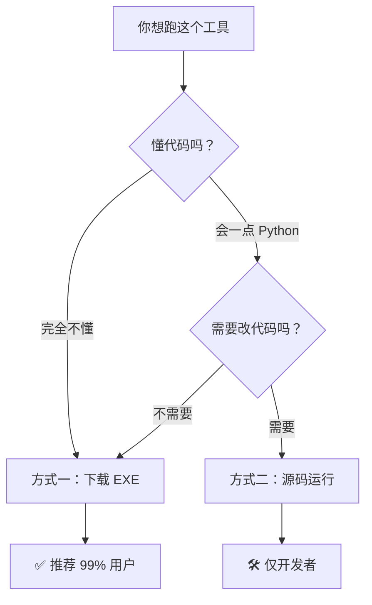

<div align="center">

# ⚡ 快速上手教程

### 🎯 5 分钟从零到第一次成功抢座

[← 返回 README](../README.md) ·
[配置详解](CONFIGURATION.md) ·
[架构文档](ARCHITECTURE.md) ·
[v3.0.0 升级日志](RELEASE_NOTES.md)

</div>

---

## 📋 电脑环境要求

| 要求 | 说明 |
|------|------|
| 💻 操作系统 | Windows 10 / 11 |
| 🌐 浏览器 | Microsoft Edge **或** Google Chrome（较新版本即可） |
| 📶 网络 | 能正常打开「辽宁大学座位预约系统」 |

> [!NOTE]
> ❌ **不需要**：Python、命令行、代码编辑器、手动下驱动
>
> ✅ **唯一要求**：能上网、电脑别太老即可

---

## 🤔 我应该用哪种方式？



---

## 🚀 方式一：下载 EXE（推荐零基础）

### Step 1️⃣ 下载

前往 [GitHub Releases](https://github.com/XUNRANA/LNU-LibSeat-Automation/releases/latest)，下载 `LNU-LibSeat-v3.0.0.zip`，解压到任意位置。

<p align="center">
  
</p>

### Step 2️⃣ 运行

双击解压后的 `LNU-LibSeat.exe`。

<p align="center">
  
</p>

### Step 3️⃣ 配置

GUI 打开后填表：

<p align="center">
  
</p>

| 区域 | 填什么 |
|------|--------|
| **🎯 目标设置** | 选校区、自习室；填最多 10 个首选座位号（**留空也行**——会自动扫整间自习室） |
| **👤 账号设置** | 学号 + 密码；初始密码 `000000`；可勾「副账号」启用第二个号分时段 |
| **📧 邮箱** | 填你的邮箱 → 抢中后秒收战报 |
| **⚡ 立即执行 / ⏰ 定时执行** | 立即=马上抢；定时=填 hh:mm 等到那个时刻 |
| **🔐 图鉴 API 抢座** | 🚫 **不要打开**！见下方 FAQ Q2 |

### Step 4️⃣ 开抢

点击「🚀 开始抢座」按钮。
程序会自动弹出浏览器、登录、进自习室、卡点提交、识别验证码——**全程你只需要看着**。

抢成功后：
- 📧 邮件秒达手机
- 📁 完整记录写入 `logs/sessions/<时间>_<学号>/`

---

## 🛠️ 方式二：Python 源码运行（开发者）

<details>
<summary><b>点击展开</b></summary>

```powershell
# 1. 克隆仓库
git clone https://github.com/XUNRANA/LNU-LibSeat-Automation
cd LNU-LibSeat-Automation

# 2. 一键启动（自动创建 venv 并装依赖）
.\run.bat

# 或手动方式
python -m venv .venv
.\.venv\Scripts\activate
pip install -r requirements.txt    # 如有 requirements.txt
python gui.py
```

或直接 `python gui.py`（已装好依赖时）。

打包成 exe：

```powershell
python build.py
```

详见 [架构文档 §「PyInstaller 打包」](ARCHITECTURE.md#pyinstaller-打包)。

</details>

---

## 🛟 常见问题 FAQ

<details>
<summary><b>Q1: 浏览器报错 "driver not found"？</b></summary>

确保网络畅通——程序会自动从微软/谷歌服务器下载对应版本的 driver。
如果墙太高，手动下载 driver 后在 `config.py` 配置 `DRIVER_PATH = "你的driver路径"`。
</details>

<details>
<summary><b>Q2: 验证码一直失败？要不要打开「图鉴 API 抢座」？</b></summary>

🚫 **不建议打开**。
- 它是付费 API（**0.016 元/次**），目前由作者自掏腰包
- 系统已在 **06:30-06:35** 高峰期**自动**启用 API
- 其他时段本地 OCR 实测：**65.7%** 一把过 / **95.2%** 三次内通过 / **100%** 五次内通过——已足够

详见 [README §「关于图鉴 API 抢座」](../README.md#-关于图鉴-api-抢座开关)。
</details>

<details>
<summary><b>Q3: 抢座失败了怎么排查？</b></summary>

打开 `logs/sessions/<时间戳>_<学号>/` 文件夹，里面有：

| 文件 | 说明 |
|------|------|
| `session.log` | 仅本次会话的完整日志 |
| `抢座顺序.txt` | 这次准备试哪些座位、什么顺序 |
| `*_1_captcha_popup_*.png` | 验证码弹窗截图 |
| `*_2_text_clicked_*.png` | 点击文字后截图 |
| `*_3_confirm_clicked_*.png` | 点击确定后截图 |
| `*_4_result_*.png` | 结果截图（成功 / 失败 / 黑名单） |
| `recordings/*.mp4` | 全程录屏 |

把这个文件夹打包发给作者就行——比口头描述清楚 100 倍。
</details>

<details>
<summary><b>Q4: 电脑会被休眠吗？10 小时挂机靠谱吗？</b></summary>

🛡️ 不会。GUI 启动时自动调用 `SetThreadExecutionState` 申请系统唤醒权限，**全程禁止系统休眠**——支持 10 小时以上挂机。
程序结束后自动恢复正常休眠策略。
</details>

<details>
<summary><b>Q5: 怎么做到每天自动跑（无人值守）？</b></summary>

用 Windows 任务计划程序：

1. Win+R → 输入 `taskschd.msc` → 回车
2. 「创建基本任务」
3. **触发器**：每天 `00:15`（程序内部会等到 06:29:30 再启动浏览器，提前 15 分钟唤醒电脑足够稳）
4. **操作**：启动程序 → 选 `LNU-LibSeat.exe`
5. 「条件」勾选 ✅ **「唤醒计算机以运行此任务」**
6. 完成

之后即使电脑睡眠，到点也会自动醒来抢座。
</details>

<details>
<summary><b>Q6: 抢座时间填什么？开始时间和结束时间有讲究吗？</b></summary>

- **开始时间**：可填任意（如 `9:00` 或 `8:30`）
- **结束时间**：⚠️ **必须填整点**（如 `15:00`、`21:00`），否则学校系统不认
- **每次最多 6 小时**（学校规则）

示例：`9:00 - 15:00`、`15:00 - 21:00`、`9:00 - 12:00`
</details>

<details>
<summary><b>Q7: 双账号怎么用？</b></summary>

GUI 上勾「启用副账号」，填第二个学号 + 密码 + 时段。
推荐分时段配合：
- 主账号：`9:00 - 15:00`
- 副账号：`15:00 - 21:00`

→ 全天 12 小时同一座位无缝衔接（前提是抢到同一座位）。

> 注意：双账号同时跑会消耗双倍 API 次数（如启用了 API），请节制。
</details>

---

## 📖 下一步

- ⚙️ [配置详解](CONFIGURATION.md) — 想手编 `config.py`？看这里
- 🏗️ [架构文档](ARCHITECTURE.md) — 想了解内部实现？
- 📦 [v3.0.0 升级日志](RELEASE_NOTES.md) — 看这次更新带来什么变化
- ☕ [README — 求赞助](../README.md#-求赞助--让免费持续) — 让免费持续下去

---

<div align="center">

**有问题？** [📮 提 Issue](https://github.com/XUNRANA/LNU-LibSeat-Automation/issues) · **觉得有用？** [⭐ Star](https://github.com/XUNRANA/LNU-LibSeat-Automation)

</div>
