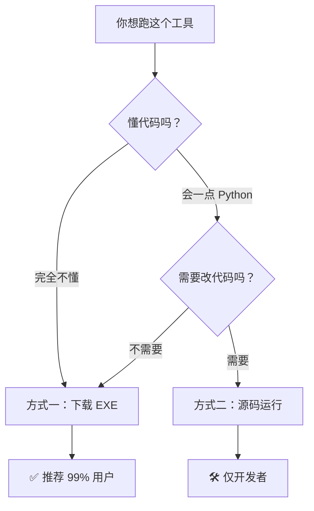

<div align="center">

# ⚡ 快速上手教程

### 🎯 5 分钟从零到第一次成功抢座

[← 返回 README](../README.md) ·
[配置详解](CONFIGURATION.md) ·
[架构文档](ARCHITECTURE.md) ·
[v5.0.0 升级日志](RELEASE_NOTES_V5.md) ·
[v3→v5 升级指南](MIGRATION_V3_TO_V5.md)

</div>

---

## 📋 电脑环境要求

| 要求 | 说明 |
|------|------|
| 💻 操作系统 | **Windows** 10 / 11，或 **macOS** 11+（Intel 原生 / Apple 芯片经 Rosetta 2 自动运行） |
| 🌐 浏览器 | Windows：Microsoft Edge **或** Chrome；macOS：Google Chrome（推荐）或 Safari（仅单账号）。较新版本即可 |
| 📶 网络 | 能正常打开「辽宁大学座位预约系统」 |

> [!NOTE]
> ❌ **不需要**：Python、命令行、代码编辑器、手动下驱动
>
> ✅ **唯一要求**：能上网、电脑别太老即可

---

## 🤔 我应该用哪种方式？


```mermaid
flowchart TD
    A[你想跑这个工具] --> B{懂代码吗？}
    B -->|完全不懂| C[方式一：下载 EXE]
    B -->|会一点 Python| D{需要改代码吗？}
    D -->|不需要| C
    D -->|需要| E[方式二：源码运行]
    C --> F[✅ 推荐 99% 用户]
    E --> G[🛠️ 仅开发者]
```

---

## 🚀 方式一：下载安装包（推荐零基础）

### Step 1️⃣ 下载

前往 [GitHub Releases](https://github.com/XUNRANA/LNU-LibSeat-Automation/releases/latest)，按系统下载并解压到任意位置：

- **Windows**：`LNU-LibSeat-v5.0.0-Windows-x86_64.zip`
- **macOS**：`LNU-LibSeat-v5.0.0-macOS-x86_64.zip`（首次运行需多一步解除限制，见下方 🍎 小节）

<p align="center">
  
</p>

### Step 2️⃣ 运行

- **Windows**：双击解压后的 `LNU-LibSeat.exe`。
- **macOS**：**右键**点击 `首次运行请先双击我.command` →「打开」→ 再点一次「打开」（首次需右键解除未签名限制），之后可直接双击 `LNU-LibSeat.app`。

<p align="center">
  
</p>

### Step 3️⃣ 配置

GUI 打开后填表：

<p align="center">
  
</p>

| 区域 | 填什么 |
|------|--------|
| **🎯 目标设置** | 选校区、自习室；填最多 10 个首选座位号（⚠️ 不能留空，至少填一个） |
| **👤 账号设置** | 学号 + 密码；初始密码 `000000`；可勾「启用更多账号」启用第二个号分时段 |
| **📧 邮箱** | 填你的邮箱 → 抢中后秒收战报 |
| **⚡ 立即执行 / ⏰ 定时执行** | 立即=马上抢；定时=填 hh:mm 等到那个时刻 |

### Step 4️⃣ 开抢

点击「🚀 开始抢座」按钮。
程序会自动弹出浏览器、登录、进自习室、卡点提交、识别验证码——**全程你只需要看着**。

抢成功后：
- 📧 邮件秒达手机
- 📁 完整记录写入 `logs/sessions/<时间>_<学号>/`

### 🍎 macOS 用户额外步骤

> [!NOTE]
> - **解除限制**：未签名 `.app` 首次必须**右键** `首次运行请先双击我.command` →「打开」→ 再「打开」；若提示「无法打开」，去 **系统设置 ▸ 隐私与安全性 ▸ 仍要打开**。之后直接双击 `LNU-LibSeat.app` 即可。
> - **支持所有 Mac**：Intel 芯片原生运行；Apple 芯片（M1/M2/M3/M4…）首次启动自动经 **Rosetta 2** 运行（系统弹窗一键安装 Rosetta）。
> - **浏览器**：默认 Chrome（支持双账号并行）；想用 Safari 需先开启 Safari ▸ 设置 ▸ 高级 ▸ 显示开发菜单 ▸ 开发 ▸ 允许远程自动化，且 Safari **仅支持单账号**。
> - **数据位置**：`config.py`、`logs/` 与 `.app` 同级，可直接查看 / 编辑。
> - **屏幕录制**在 macOS 上可能不可用（不影响抢座）。

---

## 🛠️ 方式二：Python 源码运行（开发者）

<details>
<summary><b>点击展开</b></summary>

```powershell
# 1. 克隆仓库
git clone https://github.com/XUNRANA/LNU-LibSeat-Automation
cd LNU-LibSeat-Automation

# 2. 一键启动（自动创建 venv 并装依赖）
.\run.bat

# 或手动方式
python -m venv .venv
.\.venv\Scripts\activate
pip install -r requirements.txt    # PySide6 + onnxruntime 等
python gui_qt.py                    # v5 入口（v3 是 gui.py）
```

或直接 `python gui_qt.py`（已装好依赖时）。

打包成 exe：

```powershell
python build.py
```

详见 [架构文档 §「PyInstaller 打包」](ARCHITECTURE.md#pyinstaller-打包)。

</details>

---

## 🛟 常见问题 FAQ

<details>
<summary><b>Q1: 浏览器报错 "driver not found"？</b></summary>

确保网络畅通——程序会自动从微软/谷歌服务器下载对应版本的 driver。
如果墙太高，手动下载 driver 后在 `config.py` 配置 `DRIVER_PATH = "你的driver路径"`。
</details>

<details>
<summary><b>Q2: 验证码用什么引擎？要不要付费 API？</b></summary>

✅ **v5 已切换本地 YOLO4+Siamese 模型，无需任何付费 API**。

- 模型权重内置在 exe（`core/checkpoints/`，~210MB）
- 本地推理 < 1s，离线可用
- Click1（单字）端到端准确率 **83.48%**

⏰ **仅在 06:30:00–06:35:00 启用**：其他时段不解析验证码（节省 CPU）。错峰抢座（如 14:00 放座）用户需自行调整 `logic/booker.py:LOCAL_CAPTCHA_WINDOW_*`，详见 [CAPTCHA_YOLO4_SIAMESE.md](CAPTCHA_YOLO4_SIAMESE.md)。
</details>

<details>
<summary><b>Q3: 抢座失败了怎么排查？</b></summary>

打开 `logs/sessions/<时间戳>_<学号>/` 文件夹，里面有：

| 文件 | 说明 |
|------|------|
| `session.log` | 仅本次会话的完整日志 |
| `抢座顺序.txt` | 这次准备试哪些座位、什么顺序 |
| `*_1_captcha_popup_*.png` | 验证码弹窗截图 |
| `*_2_text_clicked_*.png` | 点击文字后截图 |
| `*_3_confirm_clicked_*.png` | 点击确定后截图 |
| `*_4_result_*.png` | 结果截图（成功 / 失败 / 黑名单） |
| `recordings/*.mp4` | 全程录屏 |

把这个文件夹打包发给作者就行——比口头描述清楚 100 倍。
</details>

<details>
<summary><b>Q4: 电脑会被休眠吗？10 小时挂机靠谱吗？</b></summary>

🛡️ 不会。Windows 上 GUI 启动时自动调用 `SetThreadExecutionState` 申请系统唤醒权限；macOS 上则用系统自带 `caffeinate` 阻止休眠——两种平台都**全程禁止系统休眠**，支持 10 小时以上挂机。
程序结束后自动恢复正常休眠策略。
</details>

<details>
<summary><b>Q5: 怎么做到每天自动跑（无人值守）？</b></summary>

用 Windows 任务计划程序：

1. Win+R → 输入 `taskschd.msc` → 回车
2. 「创建基本任务」
3. **触发器**：每天 `00:15`（程序内部会等到 06:29:30 再启动浏览器，提前 15 分钟唤醒电脑足够稳）
4. **操作**：启动程序 → 选 `LNU-LibSeat.exe`
5. 「条件」勾选 ✅ **「唤醒计算机以运行此任务」**
6. 完成

之后即使电脑睡眠，到点也会自动醒来抢座。

> 🍎 **macOS**：暂无等价的一键唤醒方案，建议抢座前一晚保持 Mac 开机（合盖不关机即可）；应用运行期间会用 `caffeinate` 自动防休眠。
</details>

<details>
<summary><b>Q6: 抢座时间填什么？开始时间和结束时间有讲究吗？</b></summary>

- **开始时间**：只能填整点（如 `9:00`）或特殊值 `"现在"`（代表立即执行）
- **结束时间**：⚠️ **必须填整点**（如 `15:00`、`21:00`），否则学校系统不认
- **每次最多 6 小时**（学校规则）

示例：`9:00 - 15:00`、`15:00 - 21:00`、`9:00 - 12:00`
</details>

<details>
<summary><b>Q7: 双账号怎么用？</b></summary>

GUI 上勾「启用更多账号」，填第二个学号 + 密码 + 时段。
推荐分时段配合：
- 主账号：`9:00 - 15:00`
- 第二个账号：`15:00 - 21:00`

→ 全天 12 小时同一座位无缝衔接（前提是抢到同一座位）。

> 注意：v5 默认最多并发 **2 个账号**（`config.MAX_ACCOUNTS`）。双账号同时运行会启动两个浏览器实例，CPU/RAM 消耗加倍——建议设备至少 8GB RAM。
</details>

<details>
<summary><b>Q8: 为什么 GUI 启动后日志有「模型预加载」字样？</b></summary>

v5 启动时会在后台异步加载 YOLO4+Siamese 验证码模型（~3-5s），避免 6:30 第一次验证码冷启动。这是正常行为，不阻塞 GUI 操作。
</details>

<details>
<summary><b>Q9: 模型权重在哪？我怎么知道是不是被打包进去了？</b></summary>

- **EXE 用户**：在 `LNU-LibSeat-v5.0.0/_internal/core/checkpoints/` 下，应有 7 个文件（4 ONNX + 2 PT + 1 PTH，共 ~210MB）
- **源码用户**：在仓库根目录的 `core/checkpoints/` 下；如果该目录缺失，去 [GitHub Release](https://github.com/XUNRANA/LNU-LibSeat-Automation/releases/latest) 单独下载
</details>

---

## 📖 下一步

- ⚙️ [配置详解](CONFIGURATION.md) — 想手编 `config.py`？看这里
- 🏗️ [架构文档](ARCHITECTURE.md) — 想了解内部实现？
- 📦 [v5.0.0 升级日志](RELEASE_NOTES_V5.md) — 看这次更新带来什么变化
- 🚀 [v3→v5 升级指南](MIGRATION_V3_TO_V5.md) — 从 v3 升上来必读
- 🧠 [验证码引擎文档](CAPTCHA_YOLO4_SIAMESE.md) — YOLO4+Siamese 技术细节
- ☕ [README — 求赞助](../README.md#-求赞助--支持持续开发) — 让免费持续下去

---

<div align="center">

**有问题？** [📮 提 Issue](https://github.com/XUNRANA/LNU-LibSeat-Automation/issues) · **觉得有用？** [⭐ Star](https://github.com/XUNRANA/LNU-LibSeat-Automation)

</div>
